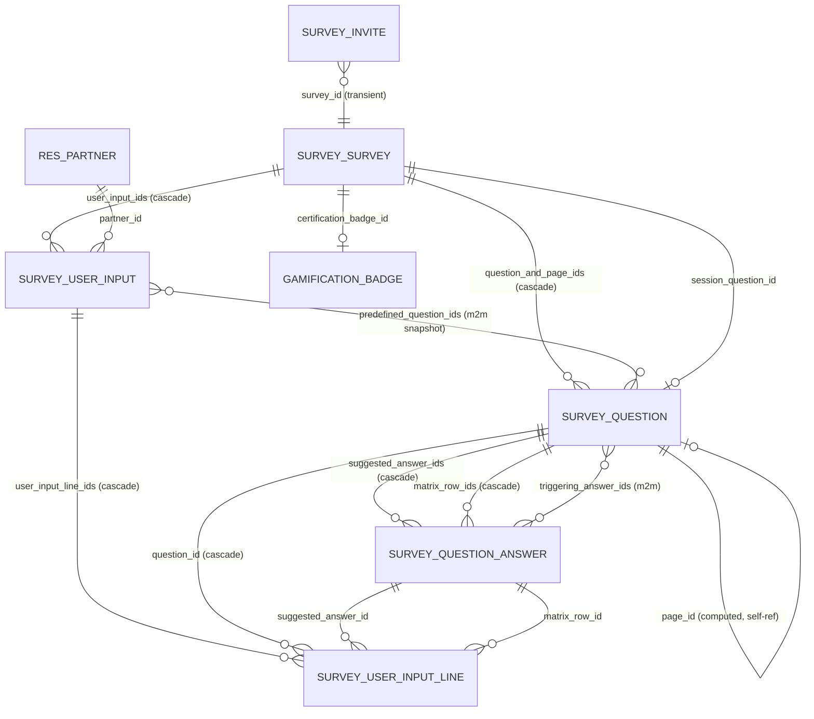
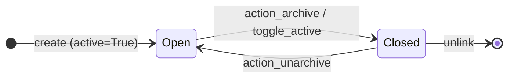
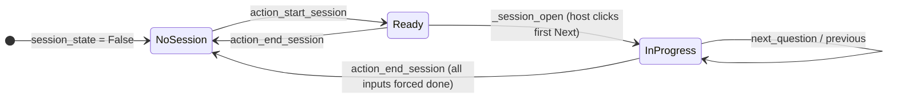
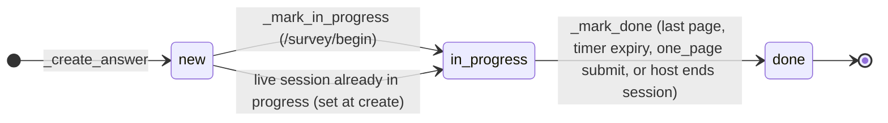
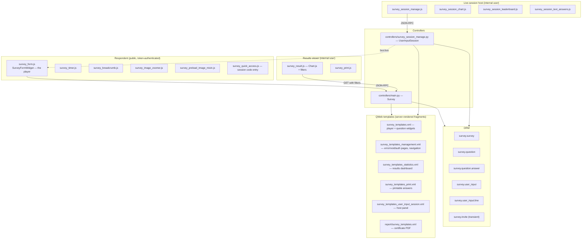

# Odoo 18 `survey` Module — Complete Functional & Technical Specification
### with a Frappe Framework v16 re-architecture plan

*Source analysed: `/opt/projects/odoo-ws/odoo18/addons/survey` (v3.7), plus the bridge modules `hr_recruitment_survey`, `hr_skills_survey`, `website_slides_survey`.*

---

## A. Executive Summary

Odoo's Survey module is a full survey/quiz/certification/live-quiz engine built on five core models and a token-based public web player. A **survey** is an ordered flat list of records in a single model (`survey.question`) where a boolean `is_page` distinguishes *sections* from *questions* — this one design decision is what makes the builder a single drag-and-drop list where you can interleave "Add a question" and "Add a section" without nesting. Questions support nine answer types (single/multi choice, matrix, scale, single-line text, multi-line text, numeric, date, datetime), per-type validation, images as answers, "other/comment" fields, and per-answer scoring with correct-answer flags.

Beyond plain data collection, the module layers four distinct product modes onto the same data model, selected by `survey_type`: **Survey** (feedback, no scoring), **Assessment** (scored, token-access certification-capable), **Live session** (a real-time "Kahoot-style" quiz where a host drives question transitions over the bus and attendees are ranked on a leaderboard with speed-weighted scoring), and **Custom**. The standout capabilities are: a **conditional-question (skip logic) engine** that works in three different execution locations depending on pagination layout; a **roaming/"go back" mode** with a skipped-mandatory-question revisit queue; **randomised question selection per section**, frozen per respondent at answer-creation time; **speed-weighted scoring** in live sessions; **PDF certificate generation** in six visual layouts with optional gamification badge award; and a **results dashboard** with cross-question answer filtering (click any answer bar to filter every other question's statistics by respondents who gave that answer).

Access is governed by an `access_token` on the survey (public link) plus an `access_token` per response (`survey.user_input`) and an optional `invite_token` that identifies a *pool of attempts* rather than a single response. All public routes are `sudo()`-ed after token validation, so the entire respondent experience works for unauthenticated users with no ACL grants at all. The backend is protected by just two groups (User / Administrator) with record rules keyed on a `restrict_user_ids` many2many. Translating this to Frappe means keeping the data model almost verbatim, replacing the token/`sudo` pattern with `@frappe.whitelist(allow_guest=True)` + `ignore_permissions`, and rebuilding the respondent player as a custom portal page rather than a Web Form — Frappe's Web Forms cannot express per-question pagination, skip logic, timers or scoring.

---

## B. Feature Inventory

Legend for **Frappe effort**: **E** = native/trivial, **M** = moderate custom code, **H** = substantial custom build.

### B.1 Survey builder

| # | Feature | Odoo implementation | Frappe effort |
|---|---|---|---|
| 1 | Single drag-drop list mixing sections & questions | `question_and_page_ids` o2m, `sequence` handle widget, custom `question_page_one2many` renderer | M |
| 2 | Inline "Add a question" / "Add a section" controls | `<control><create>` with `default_is_page` context | M |
| 3 | Duplicate question button in the list row | `button name="copy"` | E |
| 4 | Live "what this question looks like" preview per type | Static QWeb mock-ups in the question form, toggled by `question_type` | M |
| 5 | Survey type selector driving defaults | `_onchange_survey_type` rewrites 6–8 fields | E |
| 6 | Four one-click sample surveys | `survey.survey.template` model, `action_load_sample_*` | E |
| 7 | Section background images, survey background image | `background_image` on survey + page, resolved via `background_image_url` | M |
| 8 | Survey description (intro) and end message, rich text | `description`, `description_done` Html fields | E |
| 9 | Duplicate a whole survey with trigger remapping | `copy()` override zipping old/new answers | M |
| 10 | Archive/close survey (+ archives its badge) | `toggle_active` override | E |
| 11 | Warning banner when a question sits before its trigger | `is_placed_before_trigger` computed + `survey_question_trigger` widget | M |
| 12 | Question-level responsible/restriction | `restrict_user_ids` on survey, cascaded by record rules | M |
| 13 | Colour index for kanban | `color` | E |

### B.2 Question types & configuration

| # | Feature | Odoo implementation | Frappe effort |
|---|---|---|---|
| 14 | 9 question types | `question_type` selection | E |
| 15 | Suggested answers with text and/or image | `survey.question.answer.value`, `value_image` | M |
| 16 | Image-only answers get auto letter labels (A, B, C…) | `_compute_value_label` | E |
| 17 | Matrix rows (separate o2m on same model) | `matrix_row_ids` via `matrix_question_id` | E |
| 18 | Matrix single vs multiple choice per row | `matrix_subtype` | E |
| 19 | Scale question, min/max 0–10, 3 labels | `scale_min/max`, `scale_*_label` | E |
| 20 | "Other, please specify" comment box | `comments_allowed`, `comments_message` | E |
| 21 | Comment counts as an answer (satisfies mandatory) | `comment_count_as_answer` | M |
| 22 | Mandatory with custom error message | `constr_mandatory`, `constr_error_msg` | E |
| 23 | Length min/max (char), value min/max (numeric), date range | `validation_*` fields + `validation_required` | M |
| 24 | Email-format validation | `validation_email` | E |
| 25 | Save answer as respondent email / nickname | `save_as_email`, `save_as_nickname` | M |
| 26 | Placeholder text per question | `question_placeholder` | E |
| 27 | Rich-text question description (guidelines, images, video) | `description` Html | E |
| 28 | Per-question time limit (live sessions) | `is_time_limited`, `time_limit`, `is_time_customized` | M |
| 29 | Correct answer for date/datetime/numeric + points | `answer_date/datetime/numerical_box`, `answer_score` | E |
| 30 | Correct/incorrect + score per suggested answer | `is_correct`, `answer_score` (may be negative) | E |
| 31 | Auto-detect "is this question scored" | `_compute_is_scored_question` | M |

### B.3 Skip logic / conditional questions

| # | Feature | Odoo implementation | Frappe effort |
|---|---|---|---|
| 32 | Question shown only if specific answer(s) picked | `triggering_answer_ids` m2m to `survey.question.answer` | H |
| 33 | OR semantics across multiple triggers | `triggering_answers & selected_answers` | M |
| 34 | Chained conditions (A→B→C) | recursive invalidation in `_get_pages_and_questions_to_show` | H |
| 35 | Only earlier simple/multiple-choice questions may trigger | `allowed_triggering_question_ids` + domain on the m2m | M |
| 36 | Client-side instant show/hide (one_page, page_per_section) | `_checkConditionalQuestionsConfiguration` in `survey_form.js` | H |
| 37 | Server-side next-question resolution (page_per_question) | `_get_next_page_or_question` | H |
| 38 | Clear orphaned answers when a trigger is unticked | `_clear_inactive_conditional_answers` | M |
| 39 | Inactive questions removed from the respondent's question set at completion | `_mark_done` subtracts `_get_inactive_conditional_questions()` | M |
| 40 | Sections auto-hidden when all their questions are inactive | `_get_next_page_or_question` section branch | M |
| 41 | Conditional logic disabled when randomisation is on | guard in `_get_conditional_values` | E |
| 42 | Attempt limits force-disabled when conditions exist | `_compute_is_attempts_limited` | E |

### B.4 Taking the survey

| # | Feature | Odoo implementation | Frappe effort |
|---|---|---|---|
| 43 | 3 pagination layouts: one page / page per section / page per question | `questions_layout` | H |
| 44 | AJAX page transitions with fade in/out | `_nextScreen` in `survey_form.js` | M |
| 45 | Progress bar as % or "3 / 12" | `progression_mode`, `survey_progression` template | E |
| 46 | Section breadcrumb, clickable to jump back | `survey_breadcrumb.js` | M |
| 47 | Roaming (back button) | `users_can_go_back`, `_can_go_back` | H |
| 48 | Skipped-mandatory revisit queue ("Next Skipped") | `_get_next_skipped_page_or_question`, `survey_first_submitted` | H |
| 49 | Resume from cookie after closing browser | cookie `survey_<token>`, `last_displayed_page_id` | M |
| 50 | Partial save on every page submit | `_save_lines` per page | E |
| 51 | Keyboard navigation: Enter/→ next, ← back, A–Z select option | `_onKeyDown` | M |
| 52 | Countdown timer with client-clock skew correction | `survey_timer.js`, `server_time` diff | M |
| 53 | Server-side grace window against timer tampering (+10 s survey, +3 s question) | `survey_submit` guard | M |
| 54 | Auto-submit and mark done when time expires | `survey_time_limit_reached` | M |
| 55 | Answer image zoom modal | `survey_image_zoomer.js` | M |
| 56 | Background image preloading before transition | `survey_preload_image_mixin.js` | M |
| 57 | Multi-tab detection ("close other tabs") | `_checkisOnMainTab`, `MasterTabErrorModal` | M |
| 58 | Client-side validation mirroring server rules | `_validateForm` | M |
| 59 | Show correct answers immediately after each page | `scoring_with_answers_after_page` + `_showCorrectAnswers` | M |
| 60 | Test mode entry for officers | `/survey/test/<token>`, `test_entry` flag | E |
| 61 | Retry after failure while attempts remain | `/survey/retry/...` | M |
| 62 | Auto-resize textarea, autofocus first input | `_initTextArea`, `_focusOnFirstInput` | E |

### B.5 Access, invitations, attempts

| # | Feature | Odoo implementation | Frappe effort |
|---|---|---|---|
| 63 | Public link vs invited-only | `access_mode` = `public` / `token` | E |
| 64 | Per-survey access token in URL | `access_token` uuid4, unique | E |
| 65 | Per-response access token | `survey.user_input.access_token` | E |
| 66 | Invite token = shared pool of attempts | `invite_token` (non-unique by design) | M |
| 67 | Require login even with a valid token | `users_login_required` | E |
| 68 | Signup-on-the-fly for external invitees | `users_can_signup` + `signup_prepare` | M |
| 69 | Email invitation wizard (partners + raw emails) | `survey.invite` transient | M |
| 70 | New invite vs resend to existing respondents | `existing_mode`, `_get_done_partners_emails` | M |
| 71 | Per-invite answer deadline | `deadline` on user_input | E |
| 72 | Mail template with per-recipient token rendering | `mail_template_user_input_invite` | M |
| 73 | Attempt limiting per partner/email/invite-token | `_has_attempts_left`, `_get_number_of_attempts_lefts` | M |
| 74 | Attempt counter display ("Attempt 2 of 3") | `attempts_number`, `attempts_count` (raw SQL) | M |
| 75 | Anti-cheat: attempts re-checked on every submit | guard in `survey_submit` | E |
| 76 | Anonymous responses with only an email | `email`, `nickname` on user_input | E |

### B.6 Scoring & certification

| # | Feature | Odoo implementation | Frappe effort |
|---|---|---|---|
| 77 | 4 scoring modes | `scoring_type` | E |
| 78 | Pass threshold as % | `scoring_success_min`, `scoring_success` | E |
| 79 | Max obtainable score computation | `_compute_scoring_max_obtainable` | E |
| 80 | Per-line score stored at save time | `_get_answer_score_values` in `create`/`write` | M |
| 81 | Negative scores for wrong choices | `answer_score` may be < 0 | E |
| 82 | Speed-weighted score in live sessions | linear decay after 2 s, floor 50 % | M |
| 83 | Certification flag + 6 PDF layouts | `certification`, `certification_report_layout` | M |
| 84 | Certificate PDF download after success | `/survey/<id>/get_certification` | M |
| 85 | Certificate email with PDF attached | `certification_mail_template_id` | M |
| 86 | Certificate preview for the designer | `/survey/<id>/certification_preview` (creates + deletes a fake input) | M |
| 87 | Gamification badge award on success | `certification_give_badge` → goal + challenge + badge | H |
| 88 | Certification count on contact record | `res.partner.certifications_count` | E |
| 89 | Per-section correct/partial/incorrect/skipped breakdown | `_prepare_statistics` on user_input | M |

### B.7 Live sessions

| # | Feature | Odoo implementation | Frappe effort |
|---|---|---|---|
| 90 | Numeric session code + `/s/<code>` short URL | `session_code`, `_generate_session_codes` (4→10 digits) | E |
| 91 | Code entry landing page | `/s`, `survey_quick_access.js` | E |
| 92 | Host session manager screen | `/survey/session/manage/<token>` | H |
| 93 | Host-driven next/previous question pushed to all attendees | `bus.bus._sendone(access_token, 'next_question')` | H |
| 94 | Live answer count & attendee count | `session_answer_count`, `session_question_answer_count` | M |
| 95 | Live bar chart of answers | `survey_session_chart.js` (Chart.js) | M |
| 96 | Live scrolling text answers | `survey_session_text_answers.js` | M |
| 97 | Animated leaderboard with position shifts | `_prepare_leaderboard_values` + `survey_session_leaderboard.js` | H |
| 98 | Nickname capture question feeds the leaderboard | `save_as_nickname` | E |
| 99 | Conditional questions resolved by *most-voted* answer | `_get_session_most_voted_answers` (fake user_input) | H |
| 100 | End session marks every attendee done | `action_end_session` | E |
| 101 | Questions cannot be deleted during a live session | `_unlink_except_live_sessions_in_progress` | E |

### B.8 Reporting

| # | Feature | Odoo implementation | Frappe effort |
|---|---|---|---|
| 102 | Results dashboard per survey | `/survey/results/<id>` | H |
| 103 | KPI header: questions, registered, completed, success rate, avg duration, avg score | `_prepare_statistics` | M |
| 104 | Per-question chart (pie/bar/multibar) + table | `_get_stats_data`, `survey_result.js` | H |
| 105 | Click an answer to filter all other questions | `filters` query param `A,row,id\|L,0,id` | H |
| 106 | Finished / passed / failed quick filters | `_get_results_page_user_input_domain` | M |
| 107 | Comment list per question, paginated | `question_result_comments`, `question_table_pagination` | M |
| 108 | Numeric KPIs: min / max / average / 5 most common | `_get_stats_summary_data_numerical`, `_scored` | M |
| 109 | Correct / partial counts per question | `_get_stats_summary_data_choice` | M |
| 110 | Individual response printable view | `/survey/print/<token>?answer_token=` | M |
| 111 | "Review your answers" with correct answers shown | `review=True` + `scoring_display_correction` | M |
| 112 | Doughnut chart of correct/partial/incorrect/unanswered | `_prepare_statistics` totals | M |
| 113 | Per-section results bar chart | `_getSectionResultsChartConfig` | M |
| 114 | Browser print of the dashboard | `survey_results_print` button | E |
| 115 | Backend list/kanban/graph/pivot/activity views of responses | standard Odoo views | E |

### B.9 Security

| # | Feature | Odoo implementation | Frappe effort |
|---|---|---|---|
| 116 | Two groups: User, Administrator | `group_survey_user`, `group_survey_manager` | E |
| 117 | Officers see only unrestricted surveys or ones they're listed on | `ir.rule` on `restrict_user_ids` | M |
| 118 | Responsible must retain access when restricting | `_check_survey_responsible_access` | M |
| 119 | Respondents need zero ACLs (token + sudo) | controller `_fetch_from_access_token` | M |
| 120 | Cookie/partner mismatch detection | `answer_wrong_user` validity code | M |
| 121 | Specialised survey types hidden from generic rules | rule domain on `survey_type` | M |
| 122 | Input lines read-only for officers, writable for admins | `ir.model.access.csv` | E |

---

## C. Data Model Reference

### C.1 Entity relationship overview



Three relationships deserve attention because they are non-obvious:

1. **`survey.question.page_id` is computed, not stored as a real parent link.** A question "belongs to" the last section appearing before it in `sequence` order. Reordering the flat list silently re-parents questions. (It *is* `store=True`, but recomputed from sequence.)
2. **`predefined_question_ids` is a per-response snapshot** of which questions this respondent must answer. It is populated at `create()` time (so randomisation is frozen per respondent) and pruned at `_mark_done()` to drop conditional questions that never triggered. All scoring denominators use it.
3. **`invite_token` is deliberately non-unique.** Several `survey.user_input` records share one, forming a *pool of attempts* for one invited person.

---

### C.2 `survey.survey`

`_order = 'create_date DESC'`, `_rec_name = 'title'`, inherits `mail.thread`, `mail.activity.mixin`.

| Field | Type | Purpose | Notes |
|---|---|---|---|
| `survey_type` | Selection(survey, live_session, assessment, custom) | Product mode | required, default `custom`; `_onchange_survey_type` rewrites defaults; extended to `recruitment` by `hr_recruitment_survey` |
| `allowed_survey_types` | Json (computed) | Which types this user may pick | `depends_context('uid')`; empty unless `group_survey_user` |
| `title` | Char | Survey name | required, translate |
| `color` | Integer | Kanban colour index | default 0 |
| `description` | Html | Intro shown on start screen | translate, sanitize, sanitize_overridable |
| `description_done` | Html | Thank-you message | translate |
| `background_image` | Image | Survey-wide background | |
| `background_image_url` | Char (computed) | `/survey/<token>/get_background_image` | depends on `background_image`, `access_token` |
| `active` | Boolean | Archive flag = "closed" | default True; `toggle_active` also (un)archives the badge |
| `user_id` | M2O res.users | Responsible | `domain [('share','=',False)]`, tracking 1, default current user |
| `restrict_user_ids` | M2M res.users | Officers allowed to see it | tracking 2; drives all record rules |
| `question_and_page_ids` | O2M survey.question | The flat builder list | `copy=True`; inverse `survey_id` with `ondelete='cascade'` |
| `page_ids` | O2M (computed) | subset where `is_page` | |
| `question_ids` | O2M (computed) | subset where not `is_page` | |
| `question_count` | Integer (computed) | | |
| `questions_layout` | Selection(page_per_question, page_per_section, one_page) | Pagination | required, default `page_per_question` |
| `questions_selection` | Selection(all, random) | Randomise per section | required, default `all`; ignored in live sessions |
| `progression_mode` | Selection(percent, number) | Progress bar style | default `percent` |
| `user_input_ids` | O2M survey.user_input | Responses | readonly |
| `access_mode` | Selection(public, token) | Who can answer | required, default `public`. **Note:** controller code also handles legacy values `authentication` and `internal` that are no longer in the selection — treat as dead branches |
| `access_token` | Char | Public URL token | default uuid4, `copy=False`, **unique** |
| `users_login_required` | Boolean | Force login even with token | |
| `users_can_go_back` | Boolean | "Allow Roaming" | conflicts with `scoring_with_answers_after_page` (constraint) |
| `users_can_signup` | Boolean (computed) | Signup scope is b2c | reads `res.users._get_signup_invitation_scope()` |
| `answer_count` | Integer (computed) | Registered responses | |
| `answer_done_count` | Integer (computed) | Completed responses | |
| `answer_score_avg` | Float (computed) | Average score % | |
| `answer_duration_avg` | Float (computed) | Avg duration in hours | raw SQL avg over epoch diff, `state='done'` only |
| `success_count` | Integer (computed) | Passed responses | |
| `success_ratio` | Integer (computed) | Passed / registered × 100 | |
| `scoring_type` | Selection(no_scoring, scoring_with_answers_after_page, scoring_with_answers, scoring_without_answers) | Scoring mode | required, computed+stored+readonly=False+precompute |
| `scoring_success_min` | Float | Pass threshold % | default 80.0; CHECK 0–100 |
| `scoring_max_obtainable` | Float (computed) | Sum of best obtainable points | simple_choice → max positive; multiple_choice → sum positives; other → `answer_score` |
| `is_attempts_limited` | Boolean | Limit attempts | computed/stored/writable; **force-disabled** if public+no-login, or if any conditional question exists |
| `attempts_limit` | Integer | Max attempts | default 1; CHECK > 0 when limited |
| `is_time_limited` | Boolean | Whole-survey timer | |
| `time_limit` | Float | Minutes | default 10; CHECK > 0 when limited |
| `certification` | Boolean | Is a certification | computed/stored; CHECK requires scoring ≠ no_scoring |
| `certification_mail_template_id` | M2O mail.template | Success email | domain on `survey.user_input` |
| `certification_report_layout` | Selection(modern/classic × purple/blue/gold) | Certificate design | default `modern_purple` |
| `certification_give_badge` | Boolean | Award a badge | computed/stored, `copy=False`; requires `users_login_required` + `certification` |
| `certification_badge_id` | M2O gamification.badge | The badge | `copy=False`, **unique** |
| `certification_badge_id_dummy` | related | UI trick for no-create mode | |
| `session_available` | Boolean (computed) | Sessions allowed | `survey_type in (live_session, custom)` and not certification |
| `session_state` | Selection(ready, in_progress) | Session lifecycle (False = closed) | `copy=False` |
| `session_code` | Char | Numeric join code | computed/stored/writable, **unique**, `copy=False` |
| `session_link` | Char (computed) | `/s/<code>` or start URL | |
| `session_question_id` | M2O survey.question | Currently displayed question | `copy=False` |
| `session_start_time` | Datetime | Session start | used as the cut-off for "current session" answers |
| `session_question_start_time` | Datetime | Current question start (+1 s server-delay allowance) | |
| `session_answer_count` | Integer (computed) | Attendees not yet done | |
| `session_question_answer_count` | Integer (computed) | Distinct answerers of current question | |
| `session_show_leaderboard` | Boolean (computed) | scoring ≠ none AND a `save_as_nickname` question exists | |
| `session_speed_rating` | Boolean | Reward fast answers | |
| `session_speed_rating_time_limit` | Integer | Default seconds per question | CHECK > 0 when speed rating on |
| `has_conditional_questions` | Boolean (computed) | Any question has triggers | |

**SQL constraints:** unique `access_token`; unique `session_code`; certification requires scoring; `scoring_success_min` 0–100; positive `time_limit` when limited; positive `attempts_limit` when limited; unique `certification_badge_id`; positive `session_speed_rating_time_limit` when speed rating on.

**Python constraints:** roaming ⊕ per-page answer reveal; restricted survey must still include its responsible (unless they are a manager).

**Lifecycle / state machine.** There is no explicit `state` field. Two orthogonal state machines exist:





---

### C.3 `survey.question` (questions **and** sections)

`_order = 'sequence,id'`, `_rec_name = 'title'`.

| Field | Type | Purpose | Notes |
|---|---|---|---|
| `title` | Char | Question or section title | required, translate |
| `description` | Html | Guidelines / illustration | translate, sanitize |
| `question_placeholder` | Char | Input placeholder | computed/stored/writable; cleared for choice & matrix types |
| `background_image` | Image | Section background | computed/stored; cleared for non-sections |
| `background_image_url` | Char (computed) | Falls back: own section → parent section → survey | |
| `survey_id` | M2O survey.survey | Parent | `ondelete='cascade'` |
| `scoring_type` | related survey.scoring_type | | readonly |
| `sequence` | Integer | Order in the flat list | default 10 |
| `session_available`, `survey_session_speed_rating`, `survey_session_speed_rating_time_limit` | related | Live-session context | readonly |
| `is_page` | Boolean | **This record is a section** | constraint: pages must have no `question_type` |
| `question_ids` | O2M (computed) | Questions belonging to this section | sorted by `_index()` |
| `questions_selection` | related | | |
| `random_questions_count` | Integer | How many to pick from this section | default 1 |
| `page_id` | M2O self (computed, stored) | Owning section | derived from sequence order |
| `question_type` | Selection | simple_choice, multiple_choice, text_box, char_box, numerical_box, scale, date, datetime, matrix | computed/stored/writable; False for pages, default `simple_choice` |
| `is_scored_question` | Boolean | Include in quiz scoring | computed/stored/writable, `copy=True` |
| `has_image_only_suggested_answer` | Boolean (computed) | Any answer with empty text | drives column visibility |
| `answer_numerical_box` | Float | Correct numeric answer | |
| `answer_date` | Date | Correct date | CHECK: required if scored & type date |
| `answer_datetime` | Datetime | Correct datetime | CHECK: required if scored & type datetime |
| `answer_score` | Float | Points for a correct answer | CHECK ≥ 0 |
| `save_as_email` | Boolean | Store answer as respondent email | computed/stored; requires char_box + `validation_email` |
| `save_as_nickname` | Boolean | Store answer as nickname (leaderboard) | computed/stored; requires char_box |
| `suggested_answer_ids` | O2M survey.question.answer | Choices / matrix columns | `copy=True` |
| `matrix_subtype` | Selection(simple, multiple) | One vs many choices per row | default `simple` |
| `matrix_row_ids` | O2M survey.question.answer via `matrix_question_id` | Matrix rows | `copy=True` |
| `scale_min` / `scale_max` | Integer | Scale bounds | defaults 0 / 10; CHECK 0 ≤ min < max ≤ 10 |
| `scale_min_label` / `scale_mid_label` / `scale_max_label` | Char | Scale anchors | translate |
| `is_time_limited` | Boolean | Per-question timer (live only) | CHECK requires positive `time_limit` |
| `is_time_customized` | Boolean | Question deviates from survey defaults | set in `create()`, maintained by `_update_time_limit_from_survey` |
| `time_limit` | Integer | Seconds | |
| `comments_allowed` | Boolean | Show comment field | |
| `comments_message` | Char | Comment prompt | translate; default "If other, please specify:" |
| `comment_count_as_answer` | Boolean | Comment satisfies mandatory & counts in stats | |
| `validation_required` | Boolean | Enable min/max validation | computed/stored; only char_box, numerical_box, date, datetime |
| `validation_email` | Boolean | Must be an email | |
| `validation_length_min` / `_max` | Integer | Text length bounds | CHECK ≥ 0 and min ≤ max |
| `validation_min_float_value` / `_max_float_value` | Float | Numeric bounds | CHECK min ≤ max |
| `validation_min_date` / `_max_date` | Date | Date bounds | CHECK min ≤ max |
| `validation_min_datetime` / `_max_datetime` | Datetime | Datetime bounds | CHECK min ≤ max |
| `validation_error_msg` | Char | Custom validation error | translate |
| `constr_mandatory` | Boolean | Required answer | |
| `constr_error_msg` | Char | Custom required error | translate |
| `user_input_line_ids` | O2M survey.user_input.line | Answers | domain `skipped=False`, group-restricted |
| `triggering_answer_ids` | M2M survey.question.answer | Show this question only if any of these is picked | stored, `copy=False`, domain restricts to earlier choice questions of the same survey |
| `triggering_question_ids` | M2M (computed, not stored) | Questions owning those answers | |
| `allowed_triggering_question_ids` | M2M (computed) | Valid trigger candidates | uses DB sequence, not client sequence |
| `is_placed_before_trigger` | Boolean (computed) | Misplaced-question warning | |

**Deletion guard:** `_unlink_except_live_sessions_in_progress` blocks deleting questions of a survey whose session is running.

---

### C.4 `survey.question.answer`

`_order = 'question_id, sequence, id'`. Serves three roles: choice options, matrix columns (via `question_id`) and matrix rows (via `matrix_question_id`).

| Field | Type | Purpose | Notes |
|---|---|---|---|
| `question_id` | M2O survey.question | Owner as choice/column | `ondelete='cascade'`, indexed |
| `matrix_question_id` | M2O survey.question | Owner as matrix row | `ondelete='cascade'`, indexed |
| `question_type` | related | | |
| `sequence` | Integer | Order | default 10 |
| `scoring_type` | related | | |
| `value` | Char | Answer text | translate; may be empty if an image is set |
| `value_image` | Image | Answer image | max 1024×1024 |
| `value_image_filename` | Char | | |
| `value_label` | Char (computed) | `value`, or letter A–Z by index if image-only | |
| `is_correct` | Boolean | Correct choice | |
| `answer_score` | Float | Points; may be negative | |

**Constraints:** a label must have exactly one owner (`question_id` XOR `matrix_question_id`); `value` or `value_image_filename` must be set. `display_name` is elided to 90 chars as `"Question title : Answer"` (except matrix rows, which show bare value).

---

### C.5 `survey.user_input` (one response / attempt)

`_order = 'create_date desc'`, inherits `mail.thread`, `mail.activity.mixin`.

| Field | Type | Purpose | Notes |
|---|---|---|---|
| `survey_id` | M2O survey.survey | required, readonly, indexed, `ondelete='cascade'` | |
| `scoring_type` | related | | |
| `start_datetime` | Datetime | Set by `_mark_in_progress` | readonly |
| `end_datetime` | Datetime | Set by `_mark_done` | readonly |
| `deadline` | Datetime | Invite expiry | checked in `_check_validity` |
| `state` | Selection(new, in_progress, done) | default `new`, readonly | |
| `test_entry` | Boolean | Officer test run | excluded from all statistics |
| `last_displayed_page_id` | M2O survey.question | Resume point | |
| `is_attempts_limited`, `attempts_limit` | related | | |
| `attempts_count` | Integer (computed) | Total attempts in this pool | raw SQL self-join |
| `attempts_number` | Integer (computed) | This attempt's ordinal | raw SQL |
| `survey_time_limit_reached` | Boolean (computed) | now ≥ start + limit | non-stored |
| `access_token` | Char | Per-response URL token | uuid4, required, **unique**, `copy=False` |
| `invite_token` | Char | Attempt-pool identifier | **deliberately not unique** |
| `partner_id` | M2O res.partner | Identified respondent | readonly, indexed |
| `email` | Char | Respondent email | readonly |
| `nickname` | Char | Leaderboard display name | |
| `user_input_line_ids` | O2M survey.user_input.line | Answers | `copy=True` |
| `predefined_question_ids` | M2M survey.question | Frozen question set for this respondent | readonly; set at create, pruned at done |
| `scoring_percentage` | Float (computed, **stored**, compute_sudo) | Score % | |
| `scoring_total` | Float (computed, **stored**) | Raw points, digits (10,2) | |
| `scoring_success` | Boolean (computed, **stored**) | Passed | `scoring_percentage >= survey.scoring_success_min` |
| `survey_first_submitted` | Boolean | Respondent has reached the end once (roaming) | enables the "Next Skipped" queue |
| `is_session_answer` | Boolean | Part of a live session | |
| `question_time_limit_reached` | Boolean (computed) | Live-session per-question timeout | |



`_mark_done()` side effects, in order: write `end_datetime` + `state`; notify survey followers via `mail.message`; if certification + passed → send certificate email (unless test entry) and collect badge; prune inactive conditional questions from `predefined_question_ids`; run the gamification challenge cron to award badges.

---

### C.6 `survey.user_input.line` (one answer datum)

`_order = 'question_sequence, id'`. **One row per selected choice** — a multiple-choice answer with 3 ticks produces 3 rows; a matrix produces one row per (row, column) pair; a comment produces an extra `char_box` row.

| Field | Type | Purpose | Notes |
|---|---|---|---|
| `user_input_id` | M2O survey.user_input | required, indexed, `ondelete='cascade'` | |
| `survey_id` | related (stored, writable) | Denormalised for reporting | |
| `question_id` | M2O survey.question | required, indexed, `ondelete='cascade'` | |
| `page_id` | related question_id.page_id | Section | |
| `question_sequence` | related (stored) | Ordering | |
| `skipped` | Boolean | Question shown but not answered | |
| `answer_type` | Selection(text_box, char_box, numerical_box, scale, date, datetime, suggestion) | Which value column is used | False when skipped |
| `value_char_box` | Char | char_box answers **and comments** | |
| `value_numerical_box` | Float | | |
| `value_scale` | Integer | | |
| `value_date` | Date | | |
| `value_datetime` | Datetime | | |
| `value_text_box` | Text | | |
| `suggested_answer_id` | M2O survey.question.answer | Chosen option / matrix column | |
| `matrix_row_id` | M2O survey.question.answer | Matrix row | |
| `answer_score` | Float | Points earned by this line | computed in `create`/`write`, then stored |
| `answer_is_correct` | Boolean | | |

**Constraint `_check_answer_type_skipped`:** a line is either skipped or answered, never both, and the value column matching `answer_type` must be populated — with explicit exemptions so that numeric `0` and scale `0` count as real answers.

---

### C.7 `survey.invite` (TransientModel, `mail.composer.mixin`)

| Field | Type | Purpose |
|---|---|---|
| `survey_id` | M2O survey.survey (required) | Target survey |
| `partner_ids` | M2M res.partner | Recipients; domain excludes partners with no user when login is required and signup is off |
| `emails` | Text | Raw additional emails, split on `[;,\n\r]+` |
| `existing_partner_ids` / `existing_emails` / `existing_text` | computed | "Already invited" warnings |
| `existing_mode` | Selection(new, resend) | default `resend` |
| `deadline` | Datetime | Written onto every created `user_input` |
| `send_email` | Boolean (computed) | True when `access_mode == 'token'` |
| `author_id`, `mail_server_id`, `attachment_ids`, `subject`, `body`, `template_id` | composer fields | `render_model = 'survey.user_input'` |
| `survey_start_url`, `survey_access_mode`, `survey_users_login_required`, `survey_users_can_signup` | related/computed | Form logic |

---

### C.8 Extensions added by bridge modules

| Module | Model | Additions |
|---|---|---|
| `hr_recruitment_survey` | `survey.survey` | `survey_type` += `recruitment`; `hr_job_ids` |
| | `survey.user_input` | `applicant_id`; `_mark_done` posts on the applicant |
| | `hr.job` / `hr.applicant` | `survey_id`, `response_ids`, send/print/test actions |
| `hr_skills_survey` | `survey.survey` | `certification_validity_months` |
| | `survey.user_input` | `_mark_done` creates an `hr.resume.line` of type `certification` with expiry |
| `website_slides_survey` | `survey.survey` | `slide_ids`, `slide_channel_ids`, `slide_channel_count`; unlink guard; challenge category override |
| | `survey.user_input` | `slide_id`, `slide_partner_id`, `_check_for_failed_attempt` |

---

## D. Business Logic & Rules

### D.1 Answer (response) creation — `_create_answer`

```
for each survey:
    if partner given and no user and partner has users: user = partner.user_ids[0]
    _check_answer_creation(...)            # see D.2
    vals = {survey, test_entry, is_session_answer: session_state in (ready, in_progress)}
    if session_state == 'in_progress':
        vals.state = 'in_progress'; vals.start_datetime = now    # skip the 'new' screen
    identity:
        if user and not public  -> partner_id, email, nickname from user
        elif partner            -> partner_id, email, nickname from partner
        else                    -> email, nickname = given email
    invite_token:
        if passed in            -> reuse (joins an existing attempt pool)
        elif attempts limited and access_mode != 'public' -> generate a new uuid4 pool
        # public surveys deliberately share one global pool because /start creates
        # a new user_input on every landing
    create record  (create() also snapshots predefined_question_ids -> D.7)

# post-processing: prefill identity questions
for each char_box question with save_as_email or save_as_nickname:
    _save_lines(question, user_input.email / .nickname)
```

### D.2 Answer-creation guard — `_check_answer_creation`

```
if test_entry: require read access for the user, else UserError
if not test_entry:
    if not survey.active                     -> "Creating token for closed/archived surveys is not allowed"
    if access_mode == 'authentication':      # legacy branch, value no longer selectable
        if users_can_signup and no user and no partner -> error
        if not users_can_signup and (no user or public) -> error
    if access_mode == 'internal' and user not internal -> error   # legacy branch
    if check_attempts and not _has_attempts_left(...)  -> "No attempts left"
```

### D.3 Attempt-limit engine

```
_has_attempts_left(partner, email, invite_token):
    if (access_mode != 'public' OR users_login_required) AND is_attempts_limited:
        return attempts_limit - count(done, non-test responses matching identity) > 0
    return True     # unlimited

identity match = (partner_id == partner) if partner else (email == email)
                 AND (invite_token == invite_token) if invite_token given
```

Note the interaction rules baked into `_compute_is_attempts_limited`: attempt limiting is **silently switched off** if the survey is public without login, or if *any* question has triggers. Reason: with skip logic the question set varies per attempt, making "attempts" meaningless to compare; with anonymous public access there is no identity to count against.

`attempts_number` / `attempts_count` are computed by a self-join that counts all *done*, non-test responses sharing the pool, and ranks the current one by id. These are display-only.

### D.4 Skip-logic (conditional question) engine

Data shape: each question may carry `triggering_answer_ids` (a set of `survey.question.answer`). Semantics are **OR**: the question is active iff *at least one* of its triggering answers is currently selected. No triggers = always active.

Two derived maps are built once per request by `_get_conditional_maps`:

```
triggering_answers_by_question : {question -> set(answer)}
triggered_questions_by_answer  : {answer   -> set(question)}
```

**Core predicate**

```
_get_inactive_conditional_questions(user_input):
    selected = all suggested_answer_id values on this response's lines
    inactive = {}
    for question, triggers in triggering_answers_by_question:
        if triggers and (triggers ∩ selected) is empty:
            inactive += question
    return inactive
```

Note this is **single-level**: a question whose trigger sits on an inactive question is naturally inactive too, because an inactive question can have no selected answers. Chaining therefore falls out of the data rather than needing recursion at runtime.

**Builder-time validity** (`_get_pages_and_questions_to_show`) *does* need iteration. A trigger is invalid if it is a page, is not a choice question, is positioned at or after the dependent question, or is itself an invalid conditional question. Questions whose every trigger is invalid are dropped from the flow entirely:

```
candidates = questions + pages that have a description
invalid = {}
for question in candidates with triggers, in sequence order:
    if no trigger t satisfies (t not in invalid AND not t.is_page
                               AND t.type in (simple_choice, multiple_choice)
                               AND (t.sequence, t.id) < (question.sequence, question.id)):
        invalid += question
return candidates - invalid
```

**Where the logic executes depends on the layout:**

| Layout | Where | Mechanism |
|---|---|---|
| `one_page` | Client | All questions rendered; JS toggles `d-none` on change |
| `page_per_section` | Client for same-page targets, server on page load for cross-page targets | maps serialised into `data-triggered-questions-by-answer` etc. |
| `page_per_question` | Server | `_get_next_page_or_question` walks forward skipping inactive questions |

**Next-question resolution** (`_get_next_page_or_question`, `go_back` reverses direction):

```
list = pages_or_questions(layout, user_input)       # D.7
if page_or_question_id == 0: return list[0]
i = index(current)
if (go_back and i == 0) or (forward and i == last): return empty
candidates = list[:i] reversed  if go_back  else list[i+1:]
for item in candidates:
    if item.is_page:
        if any sub-question active, or (no questions and non-empty description): return item
    else:
        if item has no triggers, or triggers ∩ selected_answers: return item
return empty
```

**Is this the last screen?** (`_is_last_page_or_question`) — deliberately optimistic so the button reads "Submit" rather than "Continue":

```
if layout == one_page: True
if no candidates after current: True
page_per_question: last  <=>  (no active question follows)
                              AND (no answer of the *current* question triggers anything)
page_per_section: last   <=>  no answer in this section triggers anything
                              AND no following section has an active question
```

**Cleanup** — `_clear_inactive_conditional_answers` deletes lines belonging to now-inactive questions after each submit (page_per_question only; other layouts clean client-side). Acknowledged drawback in the source: a long free-text answer is lost if the respondent unticks then re-ticks a trigger.

### D.5 Scoring engine

**Per-line scoring** (`_get_answer_score_values`, called on every `create` and `write` of a line):

```
answer_is_correct = False ; answer_score = 0

if question.type in (simple_choice, multiple_choice) and answer_type == 'suggestion':
    answer_score      = suggested_answer.answer_score        # may be negative
    answer_is_correct = suggested_answer.is_correct

elif question.type in (date, datetime, numerical_box):
    if submitted value == question.answer_<type>:
        answer_is_correct = True
        answer_score      = question.answer_score

# live-session speed bonus, only on create, only when score > 0
if session_speed_rating and question.is_time_limited:
    t = seconds since survey.session_question_start_time
    if t > question.time_limit:                  score /= 2           # answered late
    elif t > 2:                                                       # linear decay
        p = (time_limit - t) / (time_limit - 2)
        score = (score / 2) * (1 + p)
    # t <= 2 s keeps the full score
```

Consequences worth carrying over: `char_box`, `text_box`, `matrix` and `scale` questions are **never scored**; scores are frozen at answer time (editing a correct answer later does not retro-score old responses); negative scores are possible for choices but never for whole-question `answer_score` (CHECK ≥ 0).

**Response-level scoring** (`_compute_scoring_values`, stored):

```
total_possible = 0
for question in predefined_question_ids:            # not survey.question_ids!
    if simple_choice   : += max(positive answer scores, default 0)
    elif multiple_choice: += sum(positive answer scores)
    elif is_scored_question: += question.answer_score

if total_possible == 0: percentage = total = 0
else:
    total      = sum(line.answer_score for all lines)      # negatives included
    percentage = round(total / total_possible * 100, 2), floored at 0
scoring_success = percentage >= survey.scoring_success_min
```

Because the denominator is `predefined_question_ids`, a respondent who never triggered a conditional question is not penalised for it — and since `_mark_done` prunes untriggered questions from that set, the final percentage is computed against exactly what they were asked.

**Per-response result classification** (`_prepare_statistics`), per scored question:

| Question type | correct | partial | incorrect | skipped |
|---|---|---|---|---|
| simple_choice | answer ∈ correct answers | answer ∈ incorrect-but-positively-scored answers | any other answer | no answer |
| multiple_choice | selected correct set == full correct set | selected correct set ⊂ full correct set | only incorrect selected | nothing selected |
| date/datetime/numerical | `answer_is_correct` | — | answered but wrong | skipped |

Results are grouped by section title, with questions outside any section under "Uncategorized".

### D.6 Time-limit handling

Two independent timers:

| | Survey timer | Question timer (live sessions) |
|---|---|---|
| Config | `survey.is_time_limited` + `time_limit` (minutes) | `question.is_time_limited` + `time_limit` (seconds) |
| Anchor | `user_input.start_datetime` | `survey.session_question_start_time` (= now + 1 s, to absorb server latency) |
| Client | `survey_timer.js` counts down, corrects for clock skew ≥ 500 ms using `server_time` | same widget, `time_limit/60` minutes |
| Expiry (client) | fires `time_up` → force-submits with `skipValidation` | disables the form |
| Expiry (server) | `survey_time_limit_reached` computed; page load marks the response done | `question_time_limit_reached` blocks scoring |
| Anti-tamper | submit rejected if `now > start + limit + 10 s` | rejected if `now > question start + limit + 3 s` |

On timeout the server **skips validation entirely, ignores the submitted answers, and forces `state = done`**.

### D.7 Question-set selection & randomisation

```
_prepare_user_input_predefined_questions(survey):
    questions = all questions with no page_id            # orphans, always included
    for page in survey.page_ids:
        if questions_selection == 'all':  questions += page.question_ids
        else:
            n = page.random_questions_count
            if 0 < n < len(page.question_ids): questions += random.sample(page.question_ids, n)
            else:                              questions += page.question_ids
    return questions
```

Called from `survey.user_input.create()`, so the random draw is **fixed per respondent** and stable across resumes. `_get_pages_or_questions` then intersects the layout's natural list with this snapshot, and `_get_survey_questions` does the same when validating a submit — so a respondent cannot answer a question they were not dealt.

Randomisation and conditional logic are mutually exclusive (`_get_conditional_values` short-circuits when `questions_selection == 'random'`), and randomisation is ignored in live sessions.

### D.8 Roaming and the skipped-question queue

Roaming (`users_can_go_back`) changes four behaviours:

1. **Mandatory stops being blocking.** `validate_question` returns no error for an empty mandatory answer when roaming is on — the skipped line is saved with `skipped=True` instead.
2. **Answers are overwritten rather than appended** on re-submit (`overwrite_existing=users_can_go_back`).
3. **Back navigation** is allowed (`_can_go_back`): not in one_page, not for session answers, not on the first question, not on the survey's first page.
4. **A revisit queue** activates once the respondent reaches the end:

```
on final submit:
    if roaming and any line is (skipped and question.constr_mandatory):
        survey_first_submitted = True
        show _get_next_skipped_page_or_question()         # cycles through the skipped set
    else:
        _mark_done()

_get_next_skipped_page_or_question():
    targets = sorted skipped-mandatory questions (or their pages in page_per_section)
    if last_displayed not in targets or is the last one: return targets[0]   # wrap around
    return targets[index + 1]
```

The submit button label becomes "Next Skipped" while in this mode, and the survey only completes when no skipped mandatory questions remain.

### D.9 Answer persistence — `_save_lines`

```
old = existing lines for (user_input, question)
if old and not overwrite_existing: UserError("This answer cannot be overwritten")

simple types (char_box, text_box, scale, numerical_box, date, datetime):
    write onto the existing line, or create one
    if question.save_as_email and answer: user_input.email = answer
    if question.save_as_nickname and answer: user_input.nickname = answer

choice types:
    delete all old lines, then create one line per selected answer
    empty selection -> create a single line with skipped=True   (keeps stats honest)
    a comment adds one extra line with answer_type='char_box'

matrix:
    delete all old lines, then create one line per (row, chosen column)
    empty -> one skipped line on the first row
    comment -> one extra char_box line
```

The *delete-then-recreate* strategy for choices is why answer ids are not stable across edits, and why `answer_score` is recomputed naturally on every change.

### D.10 Request payload shapes (`_extract_comment_from_answers`)

| Question type | Submitted value |
|---|---|
| text_box, char_box, numerical_box, date, datetime, scale | `"value"` |
| simple_choice | `"answer_id"` or `["answer_id", {"comment": "..."}]` |
| multiple_choice | `["id1", "id2", ...]` (+ `{"comment": "..."}`) |
| matrix | `{"row_id_1": ["col_id", ...], "row_id_2": [...], "comment": "..."}` |

The controller strips the comment element out before validation and passes it separately.

### D.11 Validation rules per question type (`validate_question`)

```
if answer empty and type not in (simple_choice, multiple_choice):
    if constr_mandatory and not users_can_go_back -> constr_error_msg
else dispatch:
  char_box      : if validation_email and not email_normalize(answer) -> "must be an email address"
                  if validation_required and not (len_min <= len(answer) <= len_max) -> validation_error_msg
  numerical_box : if not float-castable -> "This is not a number"
                  if validation_required and not (min <= v <= max) -> validation_error_msg
  date/datetime : if not parseable -> "This is not a date"
                  if validation_required and outside [min, max] -> validation_error_msg
  choice        : count = len(answers) + (1 if comment and comment_count_as_answer)
                  if count == 0 and constr_mandatory and not roaming -> constr_error_msg
                  if count > 1 and type == simple_choice -> "you can only select one answer"
  matrix        : if constr_mandatory and len(matrix_row_ids) != len(answers) -> constr_error_msg
  scale         : if constr_mandatory and not roaming and no answer -> constr_error_msg
```

The same rules are duplicated client-side in `_validateForm` purely to avoid a round trip; the server is authoritative.

### D.12 Live-session orchestration

```
Host: action_start_session
    force questions_layout = page_per_question
    session_start_time = now ; session_question_id = None ; session_state = 'ready'
    open /survey/session/manage/<access_token>

Attendees: /s/<code> or /s/<token[:6]> -> /survey/start/<token>
    _create_answer sets is_session_answer = True
    they wait on the start screen

Host: POST /survey/session/next_question
    if state == 'ready': _session_open()  -> state = 'in_progress'
    next = _get_session_next_question(go_back)
    survey.session_question_id = next
    survey.session_question_start_time = now + 1 second
    bus.bus._sendone(access_token, 'next_question', {question_start: <epoch>})
    return rendered host panel html + background url

Attendees (longpolling bus subscriber on access_token):
    on 'next_question' -> rpc /survey/next_question/<survey_token>/<answer_token>
                          which re-renders their form for survey.session_question_id
    on 'end_session'   -> show the finished screen

Host: /survey/session/results  -> chart data + up to 100 text answers for current question
Host: /survey/session/leaderboard -> rendered leaderboard html
Host: action_end_session -> session_state = False; every user_input -> done; bus 'end_session'
```

**Conditional questions in a session** cannot depend on an individual — the whole room moves together. `_get_session_most_voted_answers` therefore builds a synthetic in-memory `user_input` whose lines are the *most-voted* answer per question so far, and feeds that to the normal next-question resolver.

**Leaderboard** (`_prepare_leaderboard_values`): top 15 by `scoring_total`, but each entry is reported with its score *before* the current question plus the delta, so the frontend can animate rows overtaking each other as results are revealed.

### D.13 Certification & badges

```
on _mark_done, if survey.certification and scoring_success:
    if certification_mail_template_id and not test_entry:
        send the template (renders the PDF via the report and attaches it)
    if certification_give_badge:
        collect badge id -> after the loop, run gamification.challenge._cron_update

PDF: ir.actions.report 'survey.certification_report', qweb-pdf, A4 landscape, 0 margins.
     Layout chosen by splitting certification_report_layout on '_' -> (modern|classic, purple|blue|gold).
     Prints: recipient name (partner name or email), company name, survey title,
             create_date, company logo, seal (modern only), "Certification n°0000000042" (zero-padded id),
             a "test entry" watermark for test runs, and a "Certification Failed" variant.

Badge wiring (when certification_give_badge is switched on):
    gamification.goal.definition  domain = [('survey_id','=',id), ('scoring_success','=',True)]
                                  computation_mode = count, display_mode = boolean,
                                  batch_distinctive_field = partner_id, batch_user_expression = user.partner_id.id
    gamification.challenge        reward_id = badge, state = inprogress, period = once,
                                  reward_realtime = True, user_domain = [('karma','>',0)], visibility = personal
    gamification.challenge.line   target_goal = 1
When switched off: badge archived, challenge + goal definitions deleted.
```

### D.14 Invitation flow

```
action_send_survey -> check_validity():
    must have >= 1 question
    if scored: scoring_max_obtainable must be > 0
    if page_per_section: must have >= 1 section, and sections must contain questions
    must be active
open the survey.invite wizard

action_invite():
    resolve emails -> partners where an email_normalized match exists
        (limit=1 unless login is required, in which case all matches are taken)
    unmatched, well-formed emails stay as raw emails
    error if nothing valid
    _prepare_answers():
        find existing user_inputs for these partners/emails
        existing_mode == 'resend' -> reuse the newest response per identity
        existing_mode == 'new'    -> everyone gets a fresh response
        create missing ones with check_attempts=False and the wizard deadline
    for each answer: _send_mail() -> renders subject/body per recipient
        (so {{ object.get_start_url() }} embeds that person's token),
        wraps in the mail layout, creates a mail.mail with auto_delete
```

Guards: raw emails are rejected outright if the survey requires login and signup is off; partners without user accounts are rejected under the same condition.

### D.15 Validity gate for every public route — `_check_validity`

Returns one of: `True`, `survey_wrong`, `token_wrong`, `token_required`, `survey_auth`, `survey_closed`, `survey_void`, `answer_deadline`, `answer_wrong_user`. Evaluated in this order:

```
survey missing                                     -> survey_wrong
answer_token given but no match                    -> token_wrong
no answer and ensure_token                         -> token_required
no answer and access_mode == 'token'               -> token_required
users_login_required and current user is public    -> survey_auth
survey archived and not a test entry               -> survey_closed
no questions (or no sections in page_per_section)  -> survey_void
answer.deadline in the past                        -> answer_deadline
public user but the answer has a partner (no token)-> answer_wrong_user
logged-in user != answer.partner_id                -> answer_wrong_user
```

`survey_auth` additionally builds a signup or login redirect, calling `partner.signup_prepare()` when the invitee has no account yet and signup is allowed.

---

## E. Architecture Map

### E.1 Layering



### E.2 Backend routes

**`controllers/main.py`**

| Route | Type / auth | Purpose | Returns |
|---|---|---|---|
| `/survey/test/<survey_token>` | http, user | Create a test response | redirect to `/survey/start` |
| `/survey/retry/<survey_token>/<answer_token>` | http, public | New attempt reusing invite_token & deadline | redirect to `/survey/start` |
| `/survey/start/<survey_token>` | http, public | Resolve/create the response, set the cookie | redirect to `/survey/<token>`, `Set-Cookie: survey_<token>` (24 h) |
| `/survey/<survey_token>[/<answer_token>]` | http, public | Render the player shell | full HTML page |
| `/survey/begin/<survey_token>/<answer_token>` | **json**, public | Leave the start screen | `[{}, {survey_content, survey_progress, survey_navigation, background_image_url, has_skipped_questions}]` |
| `/survey/next_question/<survey_token>/<answer_token>` | **json**, public | Session attendee follows the host | same shape |
| `/survey/submit/<survey_token>/<answer_token>` | **json**, public | Validate + save + advance | `[correct_answers, {…same shape…}]`, or `[{}, {error: 'validation', fields: {qid: msg}}]`, or `[{}, {error: 'unauthorized' \| <validity_code>}]` |
| `/survey/<survey_token>/get_background_image` | http, public | Survey background | image stream |
| `/survey/<survey_token>/<section_id>/get_background_image` | http, public | Section background | image stream, 403 if the section is not in the survey |
| `/survey/get_question_image/<survey_token>/<answer_token>/<question_id>/<suggested_answer_id>` | http, public | Answer image | image stream, 404 if not owned by the question |
| `/survey/print/<survey_token>` | http, public | Printable survey or answers (`?answer_token=&review=`) | HTML |
| `/survey/<survey>/certification_preview` | http, user | Certificate preview page | HTML wrapper |
| `/survey/<survey>/get_certification_preview` | http, user | Preview PDF (creates then deletes a fake input) | inline PDF |
| `/survey/<survey_id>/get_certification` | http, user | Download own certificate | attachment PDF |
| `/survey/results/<survey>` | http, user | Results dashboard (`?filters=&finished=&passed=&failed=`) | HTML |

**`controllers/survey_session_manage.py`**

| Route | Type / auth | Purpose |
|---|---|---|
| `/survey/session/manage/<survey_token>` | http, user | Host panel (ready screen or manage screen) |
| `/survey/session/next_question/<survey_token>` | json, user | Advance (`go_back` optional); returns `{background_image_url, question_html}`; broadcasts on the bus |
| `/survey/session/results/<survey_token>` | json, user | `{question_statistics_graph, input_line_values, answers_validity, answer_count, attendees_count}` |
| `/survey/session/leaderboard/<survey_token>` | json, user | Rendered leaderboard HTML |
| `/s` | http, public | Session-code entry page |
| `/s/<session_code>` | http, public | Redirect into the survey (also serves `access_token[:6]` short links) |
| `/survey/check_session_code/<session_code>` | json, public | `{survey_url}` or `{error}` |

**Design pattern to note:** every "next screen" response is a *bundle of pre-rendered HTML fragments* (`survey_content`, `survey_progress`, `survey_navigation`) plus the next background URL. The client does no templating at all — it swaps innerHTML and animates. This keeps question rendering in one place (QWeb) for the player, the print view and the host panel.

### E.3 Frontend components

| Component | File | Responsibility |
|---|---|---|
| `SurveyFormWidget` | `survey_form.js` (1277 lines) | The player: keyboard nav, client validation, payload assembly, AJAX transitions, conditional show/hide, timer/breadcrumb lifecycle, correct-answer reveal, multi-tab guard, bus subscription in sessions |
| `SurveyTimerWidget` | `survey_timer.js` | Countdown with clock-skew correction; fires `time_up` |
| `SurveyBreadcrumbWidget` | `survey_breadcrumb.js` | Section breadcrumb; emits `breadcrumb_click` |
| `SurveyImageZoomer` | `survey_image_zoomer.js` | Dialog with a zoomable answer image |
| `SurveyPreloadImageMixin` | `survey_preload_image_mixin.js` | Preloads the next background before the fade completes |
| `SurveyQuickAccessWidget` | `survey_quick_access.js` | Session-code input |
| `SurveyResultChart` / `SurveyResultWidget` | `survey_result.js` (666 lines) | Chart.js bar/multibar/pie/doughnut/section charts; filter add/remove; table pagination |
| `SurveyPrintWidget` | `survey_print.js` | Print view bootstrapping |
| `SurveySessionManage` | `survey_session_manage.js` (690 lines) | Host controls, question transitions, result/leaderboard toggling |
| `SurveySessionChart` | `survey_session_chart.js` | Live answer bar chart with correct/incorrect colouring |
| `SurveySessionLeaderboard` | `survey_session_leaderboard.js` | Animated rank changes |
| `SurveySessionTextAnswers` | `survey_session_text_answers.js` | Scrolling free-text answers |

**Backend (Desk) widgets**

| Component | File | Responsibility |
|---|---|---|
| `question_page_one2many` | `question_page/question_page_one2many_field.js` | The section+question builder list |
| `QuestionPageListRenderer` | `question_page/question_page_list_renderer.js` | Section rows styled as headers, correct add-row placement |
| `survey_description_page` | `question_page/description_page_field.js` | Title cell that renders differently for sections |
| `survey_question_trigger` | `views/widgets/survey_question_trigger/` | Chain icon + tooltip showing what triggers this question, warning when misplaced |
| `boolean_update_flag` / `integer_update_flag` | `views/widgets/*_update_flag_field/` | Set `is_time_customized` when a value deviates from the survey default |
| `radio_selection_with_filter` | `views/widgets/radio_selection_with_filter/` | Survey-type radio filtered by `allowed_survey_types` |

### E.4 QWeb template map

| Template | Renders |
|---|---|
| `survey.layout` | Frontend layout override: no header/footer/livechat, background image, progress + navigation in the footer bar |
| `survey_page_fill` | Player page shell |
| `survey_fill_header` | Title, timer slot, breadcrumb container |
| `survey_fill_form` | The `<form>` with every `data-*` option the JS reads |
| `survey_fill_form_start` | Start screen: description, time limit notice, Start button |
| `survey_fill_form_in_progress` | The three layout branches + submit/next buttons |
| `survey_fill_form_done` | Score, end message, pass/fail, certificate download, badge, retake, review links |
| `question_container` | Per-question wrapper: title, mandatory asterisk, description, error slot, dispatch by type |
| `question_text_box` … `question_matrix` | One template per question type |
| `question_suggested_value_image` | Answer image with zoom affordance |
| `survey_selection_key` | The A/B/C keyboard hint chips |
| `survey_progression` | Progress bar (percent or number) |
| `survey_navigation` | Previous / submit buttons in the footer bar |
| `survey_403_page`, `survey_void_content`, `survey_auth_required`, `survey_closed_expired`, `survey_access_error` | Error states |
| `survey_button_retake`, `survey_button_form_view` | Retake button; "edit in backend" button for officers |
| `survey_session_code` | `/s` code entry |
| `survey_page_print` | Printable answers |
| `survey_page_statistics*`, `question_result_*`, `question_table_pagination` | Results dashboard |
| `user_input_session*` | Host panel and leaderboard |
| `certification_report_view*` | The PDF certificate |

---

## F. Reports & Analytics Spec

### F.1 Results dashboard — `/survey/results/<survey_id>`

**Purpose.** The analyst's single screen: how many people answered, how well they did, and what they said per question.

**Inputs.** `survey_id`; query params `finished`, `passed`, `failed` (booleans) and `filters` — a pipe-separated list of `<model_key>,<row_id>,<record_id>` triples where `A` = a `survey.question.answer` (choice/matrix) and `L` = a `survey.user_input.line` (free-text/number/date). Matrix filters carry a non-zero `row_id`.

**Base domain.** `test_entry = False` AND `survey_id = this` AND (`state = done` if `finished` else `state != new`), plus `scoring_success` true/false for passed/failed. Each active filter adds an `AND` requiring the response to own a line matching that filter, so filters intersect across questions ("people who answered *Brussels* **and** rated us *5*").

**Header KPIs** (only shown for `scoring_with_answers` / `scoring_without_answers`): Questions · Registered · Completed · Success rate % · Average duration (float_time) · Average score %.

**Per question**

| Question type | Chart | Table | Extra KPIs |
|---|---|---|---|
| simple_choice | Pie | value / votes | Correct count |
| multiple_choice | Bar (single series) | value / votes | Correct + Partial counts |
| matrix | Multibar grouped by column | rows × columns grid | — |
| scale | Bar over the min→max range | value / votes | min, max, average, top-5 most common |
| numerical_box | — | raw answer lines, paginated (10/page) | min, max, average, top-5, correct count |
| date / datetime | — | raw answer lines, paginated | top-5, correct count |
| char_box / text_box | — | raw answer lines, paginated | — |

Every question also shows `answered / shown Responded`. Correct answers are marked in chart labels via `_markIfCorrect`. Comment lines are listed separately under each choice question. Clicking a bar/slice/table row adds that filter. The whole page is browser-printable (`.d-print-none` hides controls). If the survey has a leaderboard, it is rendered at the top.

### F.2 Individual response view — `/survey/print/<survey_token>?answer_token=…`

**Purpose.** Read a single submission; with `review=True` it is the "Review your answers" link the respondent gets after finishing.

**Inputs.** Survey token, optional answer token, `review` flag. Access is lenient: officers can open it even for closed/void surveys.

**Shows.** Every question the respondent should have answered (`_get_print_questions` — active conditional questions only; in sessions, based on most-voted answers), their answers inline in the question widgets, and — when scoring is `scoring_with_answers` or `..._after_page` — the correct answers highlighted. When scored, a doughnut chart of Correct / Partially / Incorrect / Unanswered plus a per-section bar chart (`graph_data` from `user_input._prepare_statistics()`).

### F.3 Certificate PDF — `survey.certification_report`

**Purpose.** A downloadable/emailable certificate. **Inputs:** one or more `survey.user_input` ids. **Format:** A4 landscape, zero margins, DPI 96, `disable_shrinking`. **Design:** `modern` or `classic` × `purple`/`blue`/`gold`, chosen from `certification_report_layout`; modern adds a seal. **Content:** "Certificate of achievement", recipient (partner name → email), issuing company, survey title, date, company logo, zero-padded certification number, a failure variant, and a watermark for test entries. Custom fonts are bundled (Alex Brush, Ibarra Real Nova, Trueno).

### F.4 Live-session host views

| View | Purpose | Key visuals |
|---|---|---|
| Ready screen (`user_input_session_open`) | Pre-start lobby | Session code, join link/QR area, attendee counter, Start button |
| Manage screen (`user_input_session_manage`) | Drive the quiz | Current question, answer counter vs attendee counter, Next/Previous, Show Results, Show Leaderboard, Close |
| Results overlay | Reveal answers | Chart.js bar chart, correct bars in green; free text scrolls; date/char answers listed (max 100) |
| Leaderboard | Rank attendees | Top 15 by `scoring_total`, animated position shifts, per-question delta bars |

### F.5 Backend (Desk-equivalent) views

| Model | Views | Notable elements |
|---|---|---|
| `survey.survey` | kanban (default), list, form, activity, graph, pivot | Stat buttons: Registered / Certified / Participations; success-ratio progress bar; colour picker |
| `survey.user_input` | list, kanban, form, search | Search filters: completed, in progress, test entries, passed; group by survey/partner/date |
| `survey.user_input.line` | list, form, search ("Detailed Answers") | Raw answer inspection |
| `survey.question` | list, form, search | Grouped by page/type, `show_survey_field` context |
| `res.partner` | button | "Certifications" count and drill-down |

### F.6 Exports

There is **no dedicated Excel/CSV export**. Analysts use the standard Odoo list export on `survey.user_input` / `survey.user_input.line`, or print the results page from the browser. The only generated document is the certificate PDF. *This is a genuine gap worth closing in the rebuild.*

---

## G. Roles & Permissions Matrix

### G.1 Odoo roles

| Capability | Public / anonymous | Portal user | Internal employee (no survey group) | Survey **User** (officer) | Survey **Administrator** |
|---|---|---|---|---|---|
| Take a public survey | ✅ via token | ✅ | ✅ | ✅ | ✅ |
| Take a token-restricted survey | ✅ with invite link | ✅ | ✅ | ✅ | ✅ |
| Resume own response | ✅ cookie/token | ✅ | ✅ | ✅ | ✅ |
| Download own certificate | ❌ (login required) | ✅ | ✅ | ✅ | ✅ |
| Read `survey.survey` in the backend | ❌ | ❌ | ❌ | ✅ (unrestricted or listed in `restrict_user_ids`) | ✅ all |
| Create / edit / delete surveys, questions, answers | ❌ | ❌ | ❌ | ✅ (same restriction) | ✅ all |
| Read responses | ❌ | ❌ | ❌ | ✅ (same restriction, generic survey types only) | ✅ (generic types only) |
| Edit / delete responses | ❌ | ❌ | ❌ | ✅ | ✅ |
| Read answer **lines** | ❌ | ❌ | ❌ | ✅ read-only | ✅ full |
| Send invitations | ❌ | ❌ | ❌ | ✅ | ✅ |
| Run / manage a live session | ❌ | ❌ | ❌ | ✅ (any survey, via sudo) | ✅ |
| View the results dashboard | ❌ | ❌ | ❌ | ✅ | ✅ |
| Manage badges | ❌ | ❌ | ❌ | ✅ | ✅ |
| Test-mode entry | ❌ | ❌ | ❌ | ✅ | ✅ |

### G.2 Mechanisms

- **ACL** (`ir.model.access.csv`): every model grants `0,0,0,0` to the public and to `base.group_user`; only the two survey groups get rights. Officers get **read-only** on `survey.user_input.line`; administrators get full rights.
- **Record rules:** administrators see everything on surveys/questions/answers; officers are filtered by `restrict_user_ids in user OR restrict_user_ids = False`. On responses, *both* groups are additionally filtered to `survey_type in (assessment, custom, live_session, survey)` — this is the hook that hides specialised types (e.g. recruitment) from the generic Surveys app; the bridge module adds its own rules.
- **Token + sudo:** all respondent access is authorised by matching a uuid4 token and then operating `sudo()`. There are no per-record grants for respondents.
- **Field-level:** `survey.question.user_input_line_ids` is annotated `groups='survey.group_survey_user'`.
- **Sudo escalations to be aware of:** session start/stop and `session_question_id` writes (an officer may host a session on a survey they cannot write to); `scoring_*` computes (`compute_sudo=True`); statistics reads.

---

## H. Frappe v16 Mapping

App name used throughout: **`surveys`** (module **Surveys**). All DocTypes are prefixed `Survey ` to stay out of the way of other apps.

### H.1 DocType inventory

| Odoo model | Frappe DocType | Kind | Autoname |
|---|---|---|---|
| `survey.survey` | **Survey** | Submittable: **no** | `field:title` → `hash` fallback; prefer `naming_series` `SRV-.YYYY.-.####` |
| `survey.question` (is_page=0) | **Survey Question** | Child table of Survey (`parenttype=Survey`, `parentfield=questions`) — see H.2 | child (`hash`) |
| `survey.question` (is_page=1) | same table, `is_section = 1` | child row | child |
| `survey.question.answer` | **Survey Question Option** | Child table of Survey Question | child |
| `survey.user_input` | **Survey Response** | Submittable: **yes** (`is_submittable = 1`) | `naming_series` `SRES-.YYYY.-.#####` |
| `survey.user_input.line` | **Survey Response Answer** | Child table of Survey Response | child |
| `survey.invite` | **Survey Invite** (Single-shot DocType, `is_virtual = 0`, not submittable) or a dialog | standalone | `hash` |
| session state on `survey.survey` | **Survey Session** | standalone | `SSES-.YYYY.-.####` |
| gamification badge | reuse **Survey Badge** or map to an existing HR/LMS award doctype | standalone | `field:badge_name` |

**The one structural decision that matters.** Odoo's questions are a standalone model, which lets `survey.user_input.line.question_id` be a real FK and lets questions be reported on independently. Frappe child tables *can* be linked to by `Link` fields via their `name` (a hash), but child rows are deleted and recreated on parent save unless you are careful, which would orphan every historical answer.

> **Recommendation: make `Survey Question` and `Survey Question Option` standalone DocTypes, not child tables**, each with a `Link` to its parent plus an `idx`-style `sequence` Int. Use a child table **only** for the builder's drag-drop ordering surrogate if desired. This mirrors Odoo, keeps answers referentially sound forever, and is the only way `Survey Response Answer.question` can remain a valid `Link` after a survey is edited. The cost is that you lose Frappe's free grid editor and must build the builder UI (see H.9).
>
> If you accept data loss on question edits and never need historical integrity, child tables are simpler — but for an assessment/certification product this is not an acceptable trade.

### H.2 DocType: **Survey**

| Fieldname | Frappe type | Options / default | Notes |
|---|---|---|---|
| `naming_series` | Select | `SRV-.YYYY.-.####` | |
| `title` | Data | reqd | translatable via `translatable: 1` |
| `survey_type` | Select | `Survey\nLive Session\nAssessment\nCustom`, default `Custom` | drives defaults in `validate` |
| `status` | Select | `Draft\nOpen\nClosed`, default `Draft` | replaces Odoo's `active`; see H.6 |
| `responsible` | Link → User | default `__user` | |
| `restricted_to` | Table MultiSelect → **Survey User Restriction** (child, `user` Link→User) | | drives permission query |
| `color` | Color / Data | | kanban tint |
| `description` | Text Editor | | intro screen |
| `end_message` | Text Editor | | thank-you screen |
| `background_image` | Attach Image | | |
| `access_token` | Data | read_only, unique, set in `before_insert` | `frappe.generate_hash(length=32)` |
| `access_mode` | Select | `Public\nInvited Only`, default `Public` | |
| `login_required` | Check | | |
| `allow_roaming` | Check | label "Users can go back" | |
| `pagination` | Select | `One Page Per Question\nOne Page Per Section\nAll On One Page`, default first | |
| `question_selection` | Select | `All Questions\nRandomized Per Section`, default `All Questions` | |
| `progress_display` | Select | `Percentage\nNumber`, default `Percentage` | |
| `scoring_type` | Select | `No Scoring\nScoring With Answers After Page\nScoring With Answers\nScoring Without Answers` | |
| `passing_score` | Percent | default 80 | |
| `max_obtainable_score` | Float | read_only, computed in `validate` | |
| `limit_attempts` | Check | | force-disabled in `validate` per D.3 |
| `attempts_limit` | Int | default 1, `depends_on: limit_attempts` | |
| `is_time_limited` | Check | | |
| `time_limit` | Float | minutes, `depends_on` | |
| `is_certification` | Check | | |
| `certificate_layout` | Select | `Modern Purple\nModern Blue\nModern Gold\nClassic Purple\nClassic Blue\nClassic Gold` | picks the Print Format / CSS class |
| `certificate_email_template` | Link → Email Template | | |
| `give_badge` | Check | | |
| `badge` | Link → **Survey Badge** | `depends_on: give_badge` | |
| `session_enabled` | Check | read_only, computed | type ∈ (Live Session, Custom) and not certification |
| `session_code` | Data | unique, generated | numeric 4–10 digits |
| `speed_rating` | Check | | |
| `speed_rating_time_limit` | Int | seconds | |
| `has_conditional_questions` | Check | read_only, computed | |
| `response_count`, `completed_count`, `passed_count`, `avg_score`, `avg_duration` | Int / Float | read_only, **not stored as computed fields** | fill with `get_dashboard_data` / a dashboard, not on every save — see H.13 |

**Validations in `validate()`:** roaming ⊕ per-page answer reveal; certification requires scoring; `passing_score` 0–100; positive `time_limit` / `attempts_limit` when enabled; responsible must be in `restricted_to` unless they hold the Administrator role; recompute `max_obtainable_score`, `has_conditional_questions`, `session_enabled`.

### H.3 DocType: **Survey Question**

| Fieldname | Frappe type | Options / notes |
|---|---|---|
| `survey` | Link → Survey | reqd, `in_list_view`; index |
| `sequence` | Int | reqd; gaps of 10 |
| `is_section` | Check | the `is_page` equivalent |
| `section` | Link → Survey Question | read_only; recomputed on reorder (the `page_id` equivalent) |
| `title` | Small Text | reqd, translatable |
| `description` | Text Editor | |
| `question_type` | Select | `Single Choice\nMultiple Choice\nSingle Line Text\nMultiple Line Text\nNumeric\nScale\nDate\nDatetime\nMatrix`; `depends_on: eval:!doc.is_section` |
| `placeholder` | Data | |
| `background_image` | Attach Image | sections only |
| `mandatory` | Check | |
| `mandatory_error_message` | Data | |
| `random_questions_count` | Int | sections only, default 1 |
| `options` | — | reverse link from **Survey Question Option** where `question = name and is_matrix_row = 0` |
| `matrix_subtype` | Select | `One Choice Per Row\nMultiple Choices Per Row` |
| `scale_min`, `scale_max` | Int | 0 / 10 |
| `scale_min_label`, `scale_mid_label`, `scale_max_label` | Data | translatable |
| `validate_entry` | Check | |
| `validate_email` | Check | |
| `min_length`, `max_length` | Int | |
| `min_value`, `max_value` | Float | |
| `min_date`, `max_date` | Date | |
| `min_datetime`, `max_datetime` | Datetime | |
| `validation_error_message` | Data | |
| `save_as_email`, `save_as_nickname` | Check | |
| `allow_comments`, `comments_message`, `comment_counts_as_answer` | Check / Data / Check | |
| `is_scored` | Check | recomputed in `validate` |
| `correct_number` | Float | |
| `correct_date` | Date | |
| `correct_datetime` | Datetime | |
| `score` | Float | ≥ 0 |
| `triggering_options` | Table MultiSelect → **Survey Question Trigger** (child with `option` Link → Survey Question Option) | the skip-logic m2m |
| `is_time_limited`, `time_limit`, `is_time_customized` | Check / Int / Check | live sessions |

`Survey Question Option`: `question` (Link → Survey Question), `is_matrix_row` (Check), `sequence` (Int), `label` (Data, translatable), `image` (Attach Image), `is_correct` (Check), `score` (Float), `value_label` (Data, read_only — letter fallback).

> Frappe has no m2m field type. `Table MultiSelect` is the idiomatic equivalent and is what `triggering_options` should use; it stores a child table of Links, which is exactly Odoo's `triggering_answer_ids`.

### H.4 DocType: **Survey Response** (submittable)

| Fieldname | Frappe type | Notes |
|---|---|---|
| `naming_series` | Select | `SRES-.YYYY.-.#####` |
| `survey` | Link → Survey | reqd, index |
| `status` | Select | `New\nIn Progress\nCompleted`; keep **in addition to** docstatus |
| `docstatus` | (builtin) | 0 = draft while answering, 1 = submitted on completion, 2 = cancelled/voided |
| `access_token` | Data | unique, read_only, `frappe.generate_hash(length=32)` in `before_insert` |
| `invite_token` | Data | **not unique** — the attempt-pool key; index it |
| `contact` | Link → Contact | optional |
| `user` | Link → User | optional |
| `email`, `nickname` | Data | |
| `started_on`, `completed_on`, `deadline` | Datetime | |
| `is_test` | Check | excluded from analytics |
| `is_session_response` | Check | |
| `last_displayed_question` | Link → Survey Question | resume point |
| `first_submitted` | Check | roaming revisit-queue flag |
| `predefined_questions` | Table MultiSelect → **Survey Response Question** (child, `question` Link) | the frozen question set |
| `answers` | Table → **Survey Response Answer** | |
| `total_score`, `score_percentage` | Float | set in code, `read_only` |
| `passed` | Check | read_only |
| `attempt_number`, `attempt_count` | Int | read_only, computed on demand |

`Survey Response Answer` (child): `question` (Link), `section` (Link, fetched), `sequence` (Int, fetched), `skipped` (Check), `answer_type` (Select), `value_text`, `value_long_text`, `value_number` (Float), `value_scale` (Int), `value_date`, `value_datetime`, `selected_option` (Link → Survey Question Option), `matrix_row` (Link → Survey Question Option), `score` (Float), `is_correct` (Check).

> **Why submittable.** A completed response must be immutable (certificates and scores depend on it) and Frappe gives that for free via `docstatus = 1` plus `allow_on_submit` on nothing. Answering happens while `docstatus = 0`. `on_submit` becomes the natural home for everything Odoo does in `_mark_done`. Use `docstatus = 2` (cancel) instead of deleting a bad response.

### H.5 DocType: **Survey Session**, **Survey Invite**, **Survey Badge**

**Survey Session** — one row per live run, which is cleaner than Odoo's approach of storing session state on the survey itself (that design makes concurrent sessions of the same survey impossible):

| Field | Type | Notes |
|---|---|---|
| `survey` | Link → Survey | reqd |
| `session_code` | Data | unique |
| `status` | Select | `Ready\nIn Progress\nClosed` |
| `started_on` | Datetime | |
| `current_question` | Link → Survey Question | |
| `question_started_on` | Datetime | |
| `host` | Link → User | |
| `show_leaderboard` | Check | computed |

Add `session` (Link → Survey Session) to Survey Response. This is a **deliberate improvement over Odoo** — call it out to stakeholders.

**Survey Invite** — do *not* build this as a DocType if you can avoid it: Frappe's idiom is a **dialog + whitelisted method**. But a persisted DocType gives you an audit trail of who was invited when, which Odoo lacks (its wizard is transient). Recommended: a lightweight **Survey Invite** DocType with `survey`, `recipients` (Table MultiSelect → Contact), `additional_emails` (Small Text), `mode` (Select `New Invite\nResend`), `deadline`, `email_template`, `subject`, `message` (Text Editor), `sent_on`, `sent_count` — created and submitted by the dialog.

**Survey Badge** — `badge_name`, `description`, `image`, `survey` (Link, unique). Awarding is a row in **Survey Badge Award** (`badge`, `user`, `contact`, `response`, `awarded_on`) created in `Survey Response.on_submit`. This replaces Odoo's goal/challenge/badge machinery, which is far heavier than the feature needs.

### H.6 Status / state machines in Frappe

| Odoo | Frappe |
|---|---|
| `survey.active` True/False | `Survey.status` ∈ Draft / Open / Closed, with a `Status` indicator in list view; only `Open` accepts new responses |
| `user_input.state` new → in_progress → done | `Survey Response.status` mirrored by `docstatus` 0 → 0 → 1 |
| `survey.session_state` False / ready / in_progress | `Survey Session.status` Ready / In Progress / Closed |

Add to `Survey` hooks: `on_update` blocks structural edits while an attached session is In Progress (Odoo's `_unlink_except_live_sessions_in_progress`).

### H.7 Naming / autoname strategy

| DocType | Strategy | Rationale |
|---|---|---|
| Survey | `naming_series` `SRV-.YYYY.-.####` | Titles are not unique and change |
| Survey Question | `autoname: hash` | Referenced by answers forever; must never change |
| Survey Question Option | `autoname: hash` | Same |
| Survey Response | `naming_series` `SRES-.YYYY.-.#####` | Human-quotable; the certificate number uses it |
| Survey Session | `naming_series` `SSES-.YYYY.-.####` | |
| Survey Badge | `field:badge_name` | Human-readable, stable |

Never use `field:title` for questions — renaming a question would cascade through `Survey Response Answer.question`.

### H.8 Permission model

**Roles**

| Role | Maps to |
|---|---|
| **Survey Manager** | `group_survey_manager` |
| **Survey User** | `group_survey_user` |
| **Survey Respondent** | portal role for logged-in respondents (only needed for certificate download and "my responses") |
| Guest | anonymous respondents |

**DocType permissions**

| DocType | Survey Manager | Survey User | Survey Respondent | Guest |
|---|---|---|---|---|
| Survey | r w c d, `if_owner=0` | r w c d + permission query | — | — |
| Survey Question / Option | r w c d | r w c d + permission query | — | — |
| Survey Response | r w c d, submit, cancel, amend | r w c (submit) + permission query | r `if_owner` | — |
| Survey Response Answer | via parent | via parent | via parent | — |
| Survey Session | r w c d | r w c d | — | — |
| Survey Invite | r w c d | r w c | — | — |
| Survey Badge / Award | r w c d | r | r `if_owner` | — |

**Row-level restriction** — replicate `restrict_user_ids` with a permission query condition in `hooks.py`:

```python
permission_query_conditions = {
    "Survey": "surveys.surveys.doctype.survey.survey.get_permission_query_conditions",
    "Survey Question": "...survey_question.get_permission_query_conditions",
    "Survey Response": "...survey_response.get_permission_query_conditions",
}
has_permission = {
    "Survey": "surveys.surveys.doctype.survey.survey.has_permission",
    ...
}
```

```python
def get_permission_query_conditions(user=None):
    user = user or frappe.session.user
    if "Survey Manager" in frappe.get_roles(user):
        return ""
    return f"""(`tabSurvey`.name not in (
        select parent from `tabSurvey User Restriction`
    ) or `tabSurvey`.name in (
        select parent from `tabSurvey User Restriction` where user = {frappe.db.escape(user)}
    ))"""
```

**Respondent access is *not* a role.** It is token-based, exactly as in Odoo: whitelisted endpoints with `allow_guest=True` that validate `access_token` and then use `ignore_permissions=True` (or `frappe.set_user("Administrator")` scoped via `frappe.flags`). Never grant Guest read on `Survey`.

**Doc-level share** (`frappe.share.add`) is the right tool for ad-hoc "let this one colleague see this one survey's results" — Odoo has no equivalent, so treat it as a bonus feature.

**User Permissions** are *not* the right tool here: they apply per-user to a linked value and would not express "unrestricted OR listed", which is why the permission query condition is needed.

### H.9 Server-side logic

**Document hooks**

| DocType | Hook | Responsibility |
|---|---|---|
| Survey | `before_insert` | generate `access_token`, `session_code` |
| Survey | `validate` | apply `survey_type` defaults, the eight constraint checks, recompute `max_obtainable_score`, `has_conditional_questions`, force-disable `limit_attempts` per D.3 |
| Survey | `on_update` | block structural change during a live session; sync badge archive state |
| Survey | `on_trash` | cascade-delete questions, options, responses (Frappe does not cascade `Link`s — you must, and you must also guard with "cannot delete a survey that has responses" unless force) |
| Survey Question | `validate` | section must have no `question_type`; scale bounds; validation min ≤ max; scored date/datetime must have a correct answer; trigger must be an earlier choice question |
| Survey Question | `after_insert` / `on_update` | recompute `section` for all questions of the survey (the `page_id` equivalent) |
| Survey Question | `on_trash` | block during a live session; delete options |
| Survey Response | `before_insert` | `access_token`; snapshot `predefined_questions` (D.7) |
| Survey Response | `validate` | recompute `total_score`, `score_percentage`, `passed` |
| Survey Response Answer | (in parent `validate`) | compute `score` + `is_correct` per D.5 |
| Survey Response | `on_submit` | prune inactive conditional questions; send certificate email; award badge; notify survey followers; fire the `survey_response_submitted` event |
| Survey Response | `on_cancel` | reverse badge award |

Expose an `on_submit` doc event so other apps can extend it the way Odoo's bridge modules extend `_mark_done`:

```python
doc_events = {
    "Survey Response": {
        "on_submit": [
            "surveys.scoring.finalize",
            "surveys.certification.issue",
        ]
    }
}
```

**Whitelisted API** (`surveys/api/player.py`) — one module, guest-allowed, token-validated:

| Method | Args | Returns | Odoo equivalent |
|---|---|---|---|
| `start(survey_token, email=None, invite_token=None)` | | `{response_token, redirect}` | `/survey/start` |
| `get_state(survey_token, response_token)` | | full page payload (see H.10) | `/survey/<token>` |
| `begin(survey_token, response_token)` | | page payload | `/survey/begin` |
| `submit_page(survey_token, response_token, page_id, answers, previous_page=None, next_skipped=False)` | | `{errors}` or `{correct_answers, next_page}` | `/survey/submit` |
| `go_back(survey_token, response_token, page_id)` | | page payload | `previous_page_id` branch |
| `retry(survey_token, response_token)` | | `{response_token}` | `/survey/retry` |
| `check_session_code(code)` | | `{survey_url}` / `{error}` | same |
| `session_next_question(session, go_back=False)` | manager-only | `{question}` + realtime publish | same |
| `session_results(session)` | manager-only | chart payload | same |
| `session_leaderboard(session)` | manager-only | ranked list | same |

Every one of these starts with:

```python
def _resolve(survey_token, response_token):
    survey = frappe.db.get_value("Survey", {"access_token": survey_token}, "name")
    if not survey: frappe.throw(_("Survey not found"), frappe.DoesNotExistError)
    response = frappe.db.get_value("Survey Response",
        {"survey": survey, "access_token": response_token}, "name") if response_token else None
    ...validity gate per D.15...
    return frappe.get_doc("Survey", survey), frappe.get_doc("Survey Response", response)
```

and then works with `ignore_permissions=True`. **Rate-limit** `start`, `submit_page` and `check_session_code` with `frappe.rate_limiter` — Odoo relies on obscurity of the token here, and a public endpoint that creates records is an abuse vector.

**Scheduled jobs** (`hooks.py → scheduler_events`)

| Frequency | Job | Purpose |
|---|---|---|
| hourly | `close_expired_responses` | Responses past `deadline` or past the survey time limit and still `docstatus=0` → mark Completed/submit or cancel |
| hourly | `close_expired_surveys` | Optional `close_on` date → `status = Closed` (**new**; Odoo has no scheduled expiry, only manual archiving) |
| daily | `send_invite_reminders` | Nudge invitees who have not started N days before the deadline (**new**; Odoo has no reminders) |
| daily | `expire_certifications` | Mirror `hr_skills_survey.certification_validity_months` |
| daily long | `cleanup_abandoned_responses` | Delete `New` responses with no answers older than X days (Odoo accumulates these on public surveys — a real housekeeping problem) |

**Realtime** — replace `bus.bus._sendone(access_token, ...)` with:

```python
frappe.publish_realtime(
    event="survey_session_update",
    message={"action": "next_question", "question": qid, "started_at": ts},
    room=f"survey_session_{session_name}",       # or doctype/docname room
    after_commit=True,
)
```

Attendees subscribe with `frappe.realtime.on("survey_session_update", handler)`. Frappe's socketio requires an authenticated session for private rooms — for guest attendees use a public room keyed on the (unguessable) session token and put no secrets in the payload.

### H.10 Client side

**Recommendation, stated plainly:**

| Surface | Build as | Why |
|---|---|---|
| Survey builder | **Desk form script** on Survey, plus one custom control | Managers are internal users; Desk gives you list/filter/permissions/versioning free. Only the question list needs custom work. |
| Survey taking | **Custom portal page** (`www/survey/[token].html` + a Vue 3 island) | Non-negotiable — see below |
| Live-session host | **Custom portal page** (or a Desk page) | Needs full-screen presentation, charts, realtime |
| Results dashboard | **Custom portal/Desk page** with Frappe Charts | Needs cross-question filtering that no Query Report can express |
| Individual response | **Desk form** (read-only) + a **Print Format** | Free |
| Certificate | **Print Format** (HTML/Jinja) + PDF | Free |

**Why not a Web Form for survey-taking.** Frappe Web Forms can do multi-step ("Page Break" → `web_form_module`), `depends_on` visibility, and mandatory validation — so a *simple* survey is genuinely expressible. But Web Forms cannot do: one-question-per-page with server-decided ordering; a countdown timer with server-authoritative expiry; per-page scoring reveal; matrix questions; image answers with zoom; the skipped-mandatory revisit queue; keyboard A/B/C selection; live-session push; or a progress bar over a dynamically-sized question set. Bending a Web Form to fit means overriding so much of its JS that you have written a custom page anyway, with worse ergonomics. **Build the player as a custom page.**

**Recommended player stack.** A single Frappe portal page (`surveys/www/s/index.py` + `index.html`) that boots a **Vue 3** SPA island (Frappe v16 ships Vue in the Desk bundle and espresso/frappe-ui is Vue-based, so this is the lowest-friction choice; React would mean shipping a second framework). The page renders a minimal shell server-side (title, background, the survey's `<noscript>` fallback) and the SPA drives everything via the whitelisted API.

**Client/server split — keep Odoo's payload idea but invert one thing.** Odoo returns pre-rendered HTML fragments. In Frappe, return **JSON** and render client-side:

```jsonc
{
  "state": "in_progress",                   // new | in_progress | done
  "page": {
    "id": "a1b2c3",                          // question or section name
    "kind": "question",                      // question | section
    "title": "...", "description": "<p>…</p>",
    "questions": [ { /* question descriptor, see below */ } ]
  },
  "progress": {"current": 4, "total": 12, "mode": "percent"},
  "navigation": {"can_go_back": true, "previous_page": "x9", "submit_label": "Continue", "is_last": false},
  "timer": {"server_time": "...", "started_at": "...", "limit_minutes": 20},
  "background_image_url": "/files/bg.jpg",
  "conditional": {                           // only for one_page / page_per_section
     "triggering_options_by_question": {"q1": ["o3","o4"]},
     "triggered_questions_by_option": {"o3": ["q7"]},
     "selected_options": ["o3"]
  },
  "answers": { "q1": "...", "q2": ["o1","o2"] },   // prefill on resume / back
  "skipped_questions": ["q5"]
}
```

Question descriptor: `{name, type, title, description, placeholder, mandatory, error_messages:{required, validation}, options:[{name,label,image_url,letter}], matrix_rows:[...], matrix_subtype, scale:{min,max,labels}, validation:{min,max,email}, allow_comments, comments_message}`.

Why JSON rather than HTML fragments: Frappe's Jinja rendering of partials from a whitelisted method is possible (`frappe.render_template`) but you lose client-side reactivity that skip logic needs, and you would be shipping markup over the wire on every transition. Odoo's choice is a legacy of its jQuery-era player.

**Components to build** (mirroring E.3):

| Component | Responsibility |
|---|---|
| `SurveyPlayer.vue` | Root: state machine, API calls, page transitions, fade animation |
| `QuestionRenderer.vue` | Dispatch by `type` to the nine widgets |
| `ChoiceQuestion.vue` | Radio/checkbox, image answers, letter keys, "other" comment |
| `MatrixQuestion.vue` | Table on desktop, **stacked cards on mobile** (Odoo's matrix is its weakest mobile surface — improve it) |
| `ScaleQuestion.vue` | Button group with min/mid/max labels |
| `TextQuestion.vue`, `NumberQuestion.vue`, `DateQuestion.vue` | With inline validation |
| `ProgressBar.vue`, `Breadcrumb.vue`, `CountdownTimer.vue` | Chrome |
| `ImageZoom.vue` | Modal zoom |
| `useSkipLogic.js` | Composable implementing D.4 client-side |
| `useSurveyApi.js` | `frappe.call` wrapper with token injection |

**Desk form script for the builder** (`survey.js`): buttons `Test`, `Share` (opens the invite dialog), `See Results`, `Create Live Session`, `Preview Certificate`, `Load Sample`; `toggle_display` cascades mirroring Odoo's `invisible=` expressions; a `refresh` handler that renders the question list into an HTML field.

### H.11 Reports & print formats mapping

| Odoo artefact | Frappe equivalent | Notes |
|---|---|---|
| Results dashboard (`/survey/results`) | **Custom page** `surveys/www/survey-results` (or a Desk Page) using **Frappe Charts** | The cross-filter UX has no Report Builder equivalent — build it |
| Per-question statistics | Whitelisted `get_question_statistics(survey, filters)` feeding the page | Aggregate in SQL/QB, not Python loops |
| KPI header | **Number Cards** on a **Dashboard** ("Survey Analytics") | Registered / Completed / Success rate / Avg score / Avg duration |
| Response list with filters | **Report Builder** on Survey Response | Free; gives CSV/Excel export that Odoo lacks |
| "Detailed Answers" list | **Query Report** `Survey Answers` | Joins response + answer + question + option; filters: survey, question, date range, passed |
| Answer frequency table | **Query Report** `Survey Answer Distribution` | `GROUP BY question, option` with counts and % |
| Score distribution | **Query Report** + chart config `{type: "bar"}` | |
| Individual response printout | **Print Format** `Survey Response Detail` (Jinja/HTML) | Loops questions in `predefined_questions` order, shows answers and, when scoring allows, correct answers |
| Certificate PDF | **Print Format** `Survey Certificate` (HTML, landscape, `css` block per layout) + `frappe.attach_print` | Six layout variants via a body class driven by `certificate_layout`; ship the same fonts |
| Excel/CSV export | Native on every list and Query Report | **Closes an Odoo gap** |
| Live session panels | Custom page + Frappe Charts + realtime | |

Set the certificate Print Format to landscape via **Print Settings → Page Size / orientation** in the format's `print_format_builder` metadata, or attach a dedicated `Print Style`.

### H.12 A good-looking survey-taking page in Frappe

**Path: custom portal page, no Desk assets.** Serve from `surveys/www/s/index.html` with `no_cache = 1` and `frappe.website.page_renderers` for the token route, or simply `surveys/www/s/[token]/index.py` using Frappe's dynamic path segments.

```python
# surveys/www/s/index.py
import frappe
no_cache = 1

def get_context(context):
    token = frappe.form_dict.get("t")
    context.bootstrap = frappe.call("surveys.api.player.get_bootstrap", survey_token=token)
    context.no_header = True
    context.no_breadcrumbs = True
```

Do **not** extend `templates/web.html` with the standard navbar — Odoo deliberately strips header, footer and livechat for exactly this reason. Extend a bare layout.

**Layout**

```
┌───────────────────────────────────────────────┐
│  [survey title]                     ⏱ 09:42   │  ← sticky header, 64px
│  ▸ Section A › Section B › Section C          │  ← breadcrumb (page_per_section only)
├───────────────────────────────────────────────┤
│                                               │
│   Q4.  How likely are you to recommend us?  * │  ← 1.5rem, max-width 44rem, centred
│        Small helper text from description      │
│                                               │
│   ┌───┬───┬───┬───┬───┬───┬───┬───┬───┬───┐  │
│   │ 0 │ 1 │ 2 │ 3 │ 4 │ 5 │ 6 │ 7 │ 8 │ 9 │  │  ← scale: single row desktop
│   └───┴───┴───┴───┴───┴───┴───┴───┴───┴───┘  │
│   Not likely            Neutral      Very     │
│                                               │
│                    [ Continue ]  or press ⏎   │
├───────────────────────────────────────────────┤
│  ◀ Back        ▓▓▓▓▓▓▓▓░░░░░░░  4 / 12        │  ← sticky footer
└───────────────────────────────────────────────┘
```

**Rules worth copying verbatim from Odoo:** one question per screen by default; the question title is the largest thing on the page; the primary button changes colour when it is the final step; "or press Enter" hint next to the button; letters (A, B, C) on choices so keyboard users can select without the mouse; a full-bleed background image per section that cross-fades between pages, preloaded before the fade completes so there is no flash.

**Per-type rendering**

| Type | Desktop | Mobile (< 768px) |
|---|---|---|
| Single choice | Radio cards, full width; 2-col if answers have images | 1 col, 48px min touch target |
| Multiple choice | Checkbox cards | same |
| Scale | Button group, one row | Button group wraps; labels stack under |
| Matrix | Table, sticky first column and header row | **Stack: one card per row, options as chips** (do *not* inherit Odoo's horizontally-scrolling table) |
| Single-line text | Underlined input, transparent background | same |
| Multi-line text | Auto-growing textarea, 3 rows min | same |
| Numeric | `inputmode="decimal"` | numeric keypad |
| Date/Datetime | Native `<input type="date">` with a calendar affordance | native picker — a genuine improvement over Odoo's JS datepicker on mobile |
| Image answers | Grid, click to zoom | 2-col grid, tap to zoom |

**Progress bar.** Compute `total` from `predefined_questions` minus currently-inactive conditional questions, not from `survey.question_count` — otherwise a skip-logic survey shows a bar that jumps backwards. (Odoo indexes into the full list, which has exactly this artefact; fix it.)

**Mobile & a11y checklist:** 16px minimum body text (prevents iOS zoom-on-focus); `prefers-reduced-motion` disables the fade; every choice is a real `<input>` + `<label>` so screen readers and keyboard tab order work; `aria-live="polite"` on the error region; focus moves to the first field of each new page; colour is never the only signal for correct/incorrect (pair with ✓/✗ icons).

### H.13 Things to do *differently* from Odoo

| Odoo pattern | Do this instead in Frappe | Reason |
|---|---|---|
| Session state stored on `survey.survey` | Separate `Survey Session` doctype | Allows concurrent sessions; cleaner history |
| Stat fields (`answer_count`…) as stored computed fields on the survey | Compute on demand in `get_dashboard_data` / Number Cards | Frappe has no dependency-graph recompute; storing them means stale data or a write on every response |
| `page_id` derived from sequence on every recompute | Keep the same semantics, but recompute in one bulk pass per survey save | Frappe recomputes are not free; do not do it per row |
| Delete-then-recreate answer lines | Same approach (it is correct), but do it inside one `frappe.db` transaction on the parent | |
| Gamification goal + challenge + badge (3 doctypes and a cron) | Single `Survey Badge Award` row created in `on_submit` | Odoo's machinery exists because it is shared with other apps; you do not need it |
| No export | Ship Query Reports from day one | Free in Frappe, sorely missed in Odoo |
| No scheduled survey expiry | `close_on` field + hourly job | |
| Server-rendered HTML fragments over RPC | JSON payload + client rendering | Skip logic needs reactivity |
| Attempt counting via raw self-join SQL | Same query, but in Frappe Query Builder, and cache per request | |
| Public `/survey/start` creates a record on every landing | Same, **plus** a rate limiter and a cleanup job | Abuse and table-bloat vector |

---

## I. Gaps & Recommendations

Ordered by risk to the project.

### I.1 No ORM dependency graph — computed/stored fields must be hand-managed

**Gap.** Odoo leans heavily on `@api.depends` + `store=True` (`scoring_percentage`, `page_id`, `is_scored_question`, `scoring_max_obtainable`, all the statistics). Frappe has no invalidation graph; a "computed" field is just a field you write in `validate`.

**Close it by:** classifying every Odoo computed field into three buckets and handling each explicitly.
- *Derived-on-save* (`max_obtainable_score`, `is_scored`, `section`, `score_percentage`, `passed`): write in `validate` of the doc that owns them, and add a **repair patch/job** that recomputes them for existing rows when a dependency changes upstream (e.g. editing a question's score must trigger `Survey.validate` — do this by calling `frappe.get_doc("Survey", q.survey).save()` from `Survey Question.on_update`, guarded by `frappe.flags.in_survey_recompute` to avoid recursion).
- *Derived-on-read* (all statistics): never store; compute in the dashboard/report query.
- *Snapshot* (`predefined_questions`): write once at insert, prune at submit. This one is easy and must not be converted to on-demand.

**Explicit warning:** `Survey Response.score_percentage` depends on `Survey Question Option.score`. If someone edits a correct answer after responses exist, Odoo would *not* rescore either (scores are frozen on the line). Keep that behaviour and add an explicit **"Recompute scores"** button on Survey so the fix is a deliberate act.

### I.2 No many2many field type

**Gap.** `triggering_answer_ids`, `predefined_question_ids`, `restrict_user_ids` are true m2m.

**Close it by:** `Table MultiSelect` for all three (child table of Links). Querying "questions triggered by option X" becomes a child-table join rather than a direct m2m — write helper functions once (`get_triggering_options_map(survey)`) and cache per request in `frappe.local`.

### I.3 No transient (wizard) models

**Gap.** `survey.invite` is a TransientModel with `mail.composer.mixin` — rich template rendering, per-recipient rendering, attachments, "already invited" warnings.

**Close it by:** a `frappe.ui.Dialog` for the UX plus a whitelisted `send_invites()`; use **Email Template** with Jinja for the body and render per recipient with `frappe.render_template(template, {"doc": response, "start_url": ...})`. Frappe's `frappe.sendmail(..., template=..., args=...)` covers the rest. The "already invited" warning becomes a preflight call returning the overlap list.

### I.4 No equivalent of Odoo's `sudo()` idiom at record level

**Gap.** Odoo mixes user-context and sudo freely mid-method.

**Close it by:** `ignore_permissions=True` on `get_doc(...).save()/insert()`, `frappe.db.*` for reads (already permission-free), and `frappe.set_user()` only where you genuinely need the session identity changed (avoid — it leaks). Put every guest-facing write behind the `_resolve()` token gate so there is exactly one place to audit.

### I.5 Realtime is weaker than Odoo's bus for guest rooms

**Gap.** Odoo's longpolling bus channel is just a string; anyone with the survey token subscribes. Frappe's socketio authenticates sessions and its room helpers assume a logged-in user.

**Close it by:** publishing to a public room named with the unguessable session token (`frappe.publish_realtime(event, message, room=f"survey_session_{token}")`), carrying **no sensitive data** in the payload (just "advance to question N"), and having the client re-fetch state over the guest API on every event. If your deployment does not run socketio for guests at all, fall back to **polling** `session_state(token)` every 2 s — a live quiz tolerates that latency, and it removes a whole class of deployment problems. State this as an explicit deployment decision.

### I.6 No native chained/graph-based conditional logic UI

**Gap.** Odoo's trigger widget shows a chain icon, the trigger's title on hover, and a misplacement warning.

**Close it by:** custom code in the builder — a `Link`-filtered picker (`get_query` limiting to earlier choice questions of the same survey), an indicator column, and a `validate` that raises on a misplaced trigger. Budget this properly; it is the single most fiddly builder feature.

### I.7 No Odoo-style "one o2m holding two record kinds" grid

**Gap.** The builder list interleaving sections and questions, with per-row type-dependent rendering and two different "add" buttons, has no Frappe equivalent (Grid rows are uniform).

**Close it by:** a custom control in an `HTML` field on the Survey form, rendered by the form script: a SortableJS list where section rows are styled as headers, each row opens a quick-edit dialog (or routes to the Survey Question form), and two buttons add a question or a section. Persist order with a single `reorder_questions(survey, [names])` whitelisted call. **This is the highest-value UX to copy from Odoo — do not settle for a plain child-table grid.**

### I.8 Print Format is less capable than QWeb for the certificate

**Gap.** QWeb reports support paper formats, `oe_structure` editable zones, and bundled fonts through the asset pipeline.

**Close it by:** an HTML Print Format with an inline `<style>` block (Print Formats allow raw CSS), fonts served from `/assets/surveys/fonts/` and declared with `@font-face`, and landscape via the Print Format's page settings. Test with `wkhtmltopdf`/Chrome PDF whichever your instance uses — the two render `@font-face` and background images differently; embed the background as a base64 data URI if wkhtmltopdf drops it.

### I.9 No built-in "portal user sees their own responses" list

**Gap.** Odoo does not really have this either (it is a per-token link), so both are weak.

**Close it by:** a portal page `/my/surveys` listing `Survey Response` where `user = frappe.session.user`, with links to resume or review and download certificates. **This is an improvement over Odoo** — worth shipping.

### I.10 Translation of question content

**Gap.** Odoo translates `title`, `description`, option `value`, labels and error messages per record via its translation layer.

**Close it by:** setting `translatable: 1` on those fields (Frappe v16 supports per-field translation for Data/Text via the Translation doctype), or — for surveys genuinely delivered in several languages — accept the cleaner modelling: **one Survey document per language**, linked by a `translation_of` field. Recommend the latter for anything beyond UI chrome; Frappe's record-level translation is thinner than Odoo's and survey wording is content, not UI.

### I.11 Features to drop unless asked for

Be explicit with stakeholders about these, because each is expensive:

| Feature | Recommendation |
|---|---|
| Live sessions (B.7) | Phase 6, or drop. It is roughly 30 % of the module's complexity and serves a narrow use case |
| Gamification badges | Replace with the simple `Survey Badge Award` row |
| `scoring_with_answers_after_page` | Keep — cheap once the player exists |
| Randomisation | Keep — cheap |
| Roaming + skipped queue | Keep, but it is the second-most fiddly feature after skip logic; schedule it accordingly |
| Six certificate layouts | Ship two, add more later |

---

## J. Build Plan

Effort is in developer-days for one experienced Frappe developer, excluding QA.

### Phase 1 — Core data model & CRUD (8–10 d)

1. Scaffold app `surveys`, module `Surveys`.
2. DocTypes: Survey, Survey Question, Survey Question Option, Survey User Restriction, Survey Question Trigger, Survey Response, Survey Response Answer, Survey Response Question.
3. Autoname strategies per H.7; indexes on `survey`, `question`, `invite_token`, `access_token`.
4. `validate` constraints for Survey and Survey Question (the full constraint list in C.2/C.3).
5. Roles, DocType permissions, permission query conditions, `has_permission` (H.8).
6. Token generation, `status` state machines.
7. Fixtures: four sample surveys mirroring `survey_survey_template.py`.
8. Tests: constraints, permission queries, cascade deletes.

**Exit criteria:** a manager can build a multi-section survey with all nine question types in the Desk, and an officer restricted to another survey cannot see it.

### Phase 2 — Survey-taking UI (12–15 d)

9. Whitelisted player API (H.9) with the full validity gate (D.15).
10. `_resolve` token gate, rate limiting, `ignore_permissions` discipline.
11. Answer persistence per D.9, including the skipped-line and comment-line rules.
12. Server-side validation per D.11; response payload per H.10.
13. Portal page + Vue player shell; the nine question components; progress bar; navigation.
14. Three pagination layouts; resume via cookie + `last_displayed_question`.
15. Client-side mirror validation; keyboard navigation; autofocus; auto-grow textarea.
16. Mobile layouts, including the stacked matrix.
17. Start screen, finished screen, error screens (void / closed / auth required / access error).

**Exit criteria:** a respondent can complete a 20-question, 3-section survey on a phone, close the browser mid-way and resume.

### Phase 3 — Skip logic, roaming, timers (8–10 d)

18. `get_triggering_options_map` / `get_inactive_questions` (D.4).
19. Server-side next/previous resolution for `page_per_question`; client-side show/hide for the other two layouts.
20. Builder-time trigger validation + the misplaced-trigger warning (I.6).
21. Orphaned-answer cleanup; prune at submit.
22. Randomised selection snapshot (D.7); mutual exclusion with skip logic.
23. Roaming: back navigation, overwrite-on-resubmit, skipped-mandatory queue, "Next Skipped" button (D.8).
24. Survey timer with clock-skew correction and the server-side grace window (D.6).
25. Tests: the chained-condition and roaming scenarios from `test_survey_flow_with_conditions.py` and the tour files are a ready-made test matrix — port them.

**Exit criteria:** a survey with chained conditions produces the same visible question sequence as Odoo's, and a roaming respondent is walked back through every skipped mandatory question before completion.

### Phase 4 — Scoring & certification (6–8 d)

26. Per-answer scoring on save (D.5), including negative option scores.
27. Response-level scoring against `predefined_questions`; pass/fail.
28. `on_submit`: prune, score, notify, issue.
29. Per-page correct-answer reveal (`scoring_with_answers_after_page`).
30. Certificate Print Format (two layouts first), PDF generation, download endpoint gated on "has a passed response".
31. Certificate email via Email Template with `frappe.attach_print`.
32. `Survey Badge` / `Survey Badge Award`; award on submit, reverse on cancel.
33. "Review your answers" page with correct answers and the result doughnut.
34. Per-section correct/partial/incorrect/skipped breakdown.

**Exit criteria:** passing an assessment produces a downloadable certificate and an emailed PDF; failing shows the retry path.

### Phase 5 — Reports & analytics (6–8 d)

35. Results dashboard page: KPI header, per-question charts (Frappe Charts), tables with pagination.
36. Cross-question answer filtering (F.1) with URL-encoded filter state.
37. Finished / passed / failed quick filters.
38. Query Reports: Survey Answers, Survey Answer Distribution, Score Distribution.
39. Dashboard + Number Cards; Print Format for an individual response.
40. Print stylesheet for the dashboard.

**Exit criteria:** an analyst can click "Brussels" on Q1 and see every other question re-scoped to those respondents, then export the underlying rows to Excel.

### Phase 6 — Invitations & portal access (5–6 d)

41. Survey Invite doctype + dialog; partner/email resolution; new-vs-resend logic (D.14).
42. Per-recipient token rendering; deadline propagation; `check_validity` preflight.
43. Attempt limiting (D.3), attempt counters, the retry route.
44. Login-required / signup flows (`survey_auth` equivalent) using Frappe's signup + `redirect-to`.
45. `/my/surveys` portal list (I.9).
46. Scheduled jobs: expiry, reminders, cleanup, certification expiry.

**Exit criteria:** invited contacts receive personalised links, cannot exceed their attempt limit, and expired invitations show the closed screen.

### Phase 7 (optional) — Live sessions (10–14 d)

47. Survey Session doctype; code generation; `/s` and `/s/<code>` routes.
48. Host panel: start, next/previous, close, counters.
49. Realtime push (or the polling fallback per I.5).
50. Live answer chart, text-answer ticker.
51. Speed-weighted scoring (D.5).
52. Leaderboard with animated position shifts (D.12).
53. Most-voted-answer conditional resolution.
54. Guard against structural edits during a running session.

**Exit criteria:** a host runs a 10-question quiz for 30 attendees on their phones with a live leaderboard.

### Cross-cutting, every phase

- Port Odoo's test suite as the acceptance matrix: `test_survey_flow.py`, `test_survey_flow_with_conditions.py`, `test_certification_flow.py`, `test_survey_invite.py`, `test_survey_randomize.py`, `test_survey_security.py`, `test_survey_results.py` and the JS tours under `static/tests/tours/` map almost one-to-one onto Frappe unit tests + Cypress specs.
- Keep an `ODOO_PARITY.md` ticking off the 122 features in Section B.
- Decide the realtime-vs-polling question (I.5) and the translation strategy (I.10) before Phase 2, since both affect the player's architecture.
